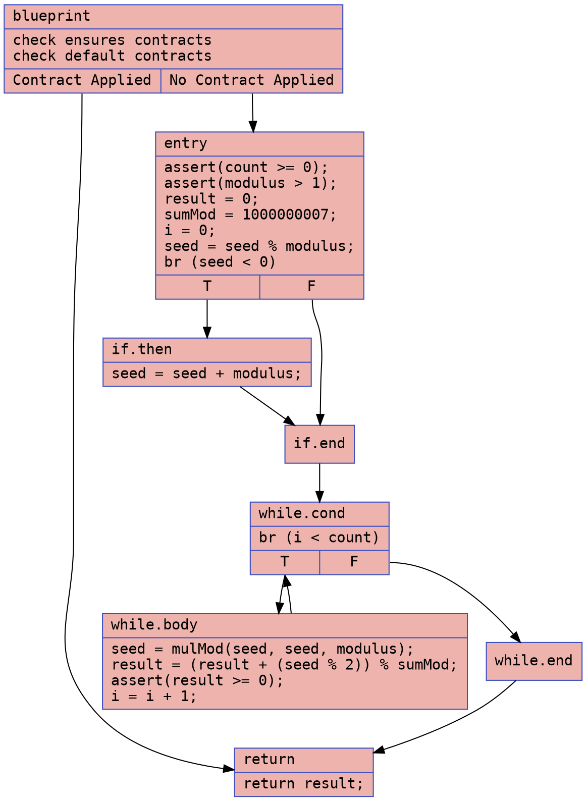
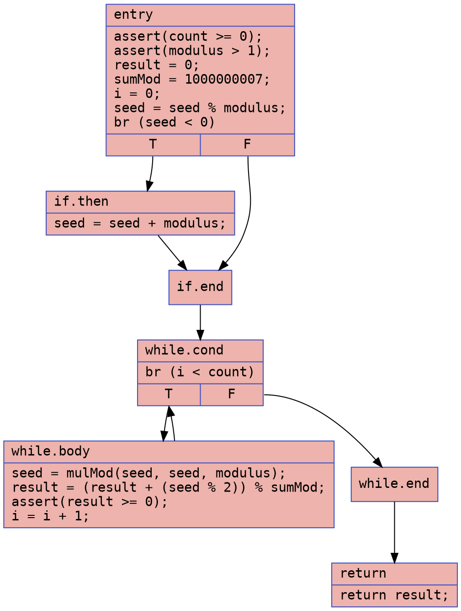

# BBS Bits Example

## `bbs_bits.bps`

### CFG (.dot)


### Cyclomatic Complexity
Number of Nodes = 8
Number of Edges = 10 
Cyclomatic Complexity = E - N + 2 = 10 - 8 + 2 = 4

## `bbs_bits-defensive.bps`

### CFG (.dot)


### Cyclomatic Complexity
Number of Nodes = 7
Number of Edges = 8
Cyclomatic Complexity = E - N + 2 = 8 - 7 + 2 = 3

## `bbs_bits.ll`

### CFG (.dot)
```dot
digraph "CFG for 'main' function" {
	label="CFG for 'main' function";

	Node0x55777b8f95f0 [shape=record,color="#3d50c3ff", style=filled, fillcolor="#d6524470", fontname="Courier",label="{entry:\l|  br label %loopbody.i.1.i\l}"];
	Node0x55777b8f95f0 -> Node0x55777b8f9700;
	Node0x55777b8f9700 [shape=record,color="#b70d28ff", style=filled, fillcolor="#b70d2870", fontname="Courier",label="{loopbody.i.1.i:\l|  %a.147.i.1.i = phi i32 [ 591446, %entry ], [ %modtmp27.i.1.i.4,\l... %ifcont17.i.1.i.4 ]\l  %b.046.i.1.i = phi i32 [ 591446, %entry ], [ %divtmp44.i.1.i,\l... %ifcont17.i.1.i.4 ]\l  %result.045.i.1.i = phi i32 [ 0, %entry ], [ %result.1.i.1.i.4,\l... %ifcont17.i.1.i.4 ]\l  %modtmp13.i.1.i = and i32 %b.046.i.1.i, 1\l  %eqtmp14.not.i.1.i = icmp eq i32 %modtmp13.i.1.i, 0\l  br i1 %eqtmp14.not.i.1.i, label %ifcont17.i.1.i, label %then15.i.1.i\l|{<s0>T|<s1>F}}"];
	Node0x55777b8f9700:s0 -> Node0x55777b8fcfd0;
	Node0x55777b8f9700:s1 -> Node0x55777b8fd090;
	Node0x55777b8fd090 [shape=record,color="#3d50c3ff", style=filled, fillcolor="#be242e70", fontname="Courier",label="{then15.i.1.i:\l|  %addtmp20.i.1.i = add nuw nsw i32 %result.045.i.1.i, %a.147.i.1.i\l  %modtmp22.i.1.i = urem i32 %addtmp20.i.1.i, 1000003\l  br label %ifcont17.i.1.i\l}"];
	Node0x55777b8fd090 -> Node0x55777b8fcfd0;
	Node0x55777b8fcfd0 [shape=record,color="#b70d28ff", style=filled, fillcolor="#b70d2870", fontname="Courier",label="{ifcont17.i.1.i:\l|  %result.1.i.1.i = phi i32 [ %modtmp22.i.1.i, %then15.i.1.i ], [\l... %result.045.i.1.i, %loopbody.i.1.i ]\l  %addtmp25.i.1.i = shl nuw nsw i32 %a.147.i.1.i, 1\l  %modtmp27.i.1.i = urem i32 %addtmp25.i.1.i, 1000003\l  %divtmp44.i.1.i = lshr i32 %b.046.i.1.i, 5\l  %0 = and i32 %b.046.i.1.i, 2\l  %eqtmp14.not.i.1.i.1 = icmp eq i32 %0, 0\l  br i1 %eqtmp14.not.i.1.i.1, label %ifcont17.i.1.i.1, label %then15.i.1.i.1\l|{<s0>T|<s1>F}}"];
	Node0x55777b8fcfd0:s0 -> Node0x55777b8fc340;
	Node0x55777b8fcfd0:s1 -> Node0x55777b8fd8e0;
	Node0x55777b8fd8e0 [shape=record,color="#3d50c3ff", style=filled, fillcolor="#be242e70", fontname="Courier",label="{then15.i.1.i.1:\l|  %addtmp20.i.1.i.1 = add nuw nsw i32 %result.1.i.1.i, %modtmp27.i.1.i\l  %modtmp22.i.1.i.1 = urem i32 %addtmp20.i.1.i.1, 1000003\l  br label %ifcont17.i.1.i.1\l}"];
	Node0x55777b8fd8e0 -> Node0x55777b8fc340;
	Node0x55777b8fc340 [shape=record,color="#b70d28ff", style=filled, fillcolor="#b70d2870", fontname="Courier",label="{ifcont17.i.1.i.1:\l|  %result.1.i.1.i.1 = phi i32 [ %modtmp22.i.1.i.1, %then15.i.1.i.1 ], [\l... %result.1.i.1.i, %ifcont17.i.1.i ]\l  %addtmp25.i.1.i.1 = shl nuw nsw i32 %modtmp27.i.1.i, 1\l  %modtmp27.i.1.i.1 = urem i32 %addtmp25.i.1.i.1, 1000003\l  %1 = and i32 %b.046.i.1.i, 4\l  %eqtmp14.not.i.1.i.2 = icmp eq i32 %1, 0\l  br i1 %eqtmp14.not.i.1.i.2, label %ifcont17.i.1.i.2, label %then15.i.1.i.2\l|{<s0>T|<s1>F}}"];
	Node0x55777b8fc340:s0 -> Node0x55777b8fdfc0;
	Node0x55777b8fc340:s1 -> Node0x55777b8fe080;
	Node0x55777b8fe080 [shape=record,color="#3d50c3ff", style=filled, fillcolor="#be242e70", fontname="Courier",label="{then15.i.1.i.2:\l|  %addtmp20.i.1.i.2 = add nuw nsw i32 %result.1.i.1.i.1, %modtmp27.i.1.i.1\l  %modtmp22.i.1.i.2 = urem i32 %addtmp20.i.1.i.2, 1000003\l  br label %ifcont17.i.1.i.2\l}"];
	Node0x55777b8fe080 -> Node0x55777b8fdfc0;
	Node0x55777b8fdfc0 [shape=record,color="#b70d28ff", style=filled, fillcolor="#b70d2870", fontname="Courier",label="{ifcont17.i.1.i.2:\l|  %result.1.i.1.i.2 = phi i32 [ %modtmp22.i.1.i.2, %then15.i.1.i.2 ], [\l... %result.1.i.1.i.1, %ifcont17.i.1.i.1 ]\l  %addtmp25.i.1.i.2 = shl nuw nsw i32 %modtmp27.i.1.i.1, 1\l  %modtmp27.i.1.i.2 = urem i32 %addtmp25.i.1.i.2, 1000003\l  %2 = and i32 %b.046.i.1.i, 8\l  %eqtmp14.not.i.1.i.3 = icmp eq i32 %2, 0\l  br i1 %eqtmp14.not.i.1.i.3, label %ifcont17.i.1.i.3, label %then15.i.1.i.3\l|{<s0>T|<s1>F}}"];
	Node0x55777b8fdfc0:s0 -> Node0x55777b8fe6e0;
	Node0x55777b8fdfc0:s1 -> Node0x55777b8fe7a0;
	Node0x55777b8fe7a0 [shape=record,color="#3d50c3ff", style=filled, fillcolor="#be242e70", fontname="Courier",label="{then15.i.1.i.3:\l|  %addtmp20.i.1.i.3 = add nuw nsw i32 %result.1.i.1.i.2, %modtmp27.i.1.i.2\l  %modtmp22.i.1.i.3 = urem i32 %addtmp20.i.1.i.3, 1000003\l  br label %ifcont17.i.1.i.3\l}"];
	Node0x55777b8fe7a0 -> Node0x55777b8fe6e0;
	Node0x55777b8fe6e0 [shape=record,color="#b70d28ff", style=filled, fillcolor="#b70d2870", fontname="Courier",label="{ifcont17.i.1.i.3:\l|  %result.1.i.1.i.3 = phi i32 [ %modtmp22.i.1.i.3, %then15.i.1.i.3 ], [\l... %result.1.i.1.i.2, %ifcont17.i.1.i.2 ]\l  %addtmp25.i.1.i.3 = shl nuw nsw i32 %modtmp27.i.1.i.2, 1\l  %modtmp27.i.1.i.3 = urem i32 %addtmp25.i.1.i.3, 1000003\l  %3 = and i32 %b.046.i.1.i, 16\l  %eqtmp14.not.i.1.i.4 = icmp eq i32 %3, 0\l  br i1 %eqtmp14.not.i.1.i.4, label %ifcont17.i.1.i.4, label %then15.i.1.i.4\l|{<s0>T|<s1>F}}"];
	Node0x55777b8fe6e0:s0 -> Node0x55777b8fc110;
	Node0x55777b8fe6e0:s1 -> Node0x55777b8fee90;
	Node0x55777b8fee90 [shape=record,color="#3d50c3ff", style=filled, fillcolor="#be242e70", fontname="Courier",label="{then15.i.1.i.4:\l|  %addtmp20.i.1.i.4 = add nuw nsw i32 %result.1.i.1.i.3, %modtmp27.i.1.i.3\l  %modtmp22.i.1.i.4 = urem i32 %addtmp20.i.1.i.4, 1000003\l  br label %ifcont17.i.1.i.4\l}"];
	Node0x55777b8fee90 -> Node0x55777b8fc110;
	Node0x55777b8fc110 [shape=record,color="#b70d28ff", style=filled, fillcolor="#b70d2870", fontname="Courier",label="{ifcont17.i.1.i.4:\l|  %result.1.i.1.i.4 = phi i32 [ %modtmp22.i.1.i.4, %then15.i.1.i.4 ], [\l... %result.1.i.1.i.3, %ifcont17.i.1.i.3 ]\l  %addtmp25.i.1.i.4 = shl nuw nsw i32 %modtmp27.i.1.i.3, 1\l  %modtmp27.i.1.i.4 = urem i32 %addtmp25.i.1.i.4, 1000003\l  %gttmp.not.i.1.i.4 = icmp eq i32 %divtmp44.i.1.i, 0\l  br i1 %gttmp.not.i.1.i.4, label %mulMod.exit.1.i, label %loopbody.i.1.i\l|{<s0>T|<s1>F}}"];
	Node0x55777b8fc110:s0 -> Node0x55777b8fb950;
	Node0x55777b8fc110:s1 -> Node0x55777b8f9700;
	Node0x55777b8fb950 [shape=record,color="#3d50c3ff", style=filled, fillcolor="#d6524470", fontname="Courier",label="{mulMod.exit.1.i:\l|  %eqtmp3.i.2.i = icmp eq i32 %result.1.i.1.i.4, 0\l  br i1 %eqtmp3.i.2.i, label %bbsBits.exit, label %loopbody.i.2.i\l|{<s0>T|<s1>F}}"];
	Node0x55777b8fb950:s0 -> Node0x55777b8fc990;
	Node0x55777b8fb950:s1 -> Node0x55777b9003a0;
	Node0x55777b9003a0 [shape=record,color="#b70d28ff", style=filled, fillcolor="#bb1b2c70", fontname="Courier",label="{loopbody.i.2.i:\l|  %a.147.i.2.i = phi i32 [ %modtmp27.i.2.i, %ifcont17.i.2.i ], [\l... %result.1.i.1.i.4, %mulMod.exit.1.i ]\l  %b.046.i.2.i = phi i32 [ %divtmp44.i.2.i, %ifcont17.i.2.i ], [\l... %result.1.i.1.i.4, %mulMod.exit.1.i ]\l  %result.045.i.2.i = phi i32 [ %result.1.i.2.i, %ifcont17.i.2.i ], [ 0,\l... %mulMod.exit.1.i ]\l  %modtmp13.i.2.i = and i32 %b.046.i.2.i, 1\l  %eqtmp14.not.i.2.i = icmp eq i32 %modtmp13.i.2.i, 0\l  br i1 %eqtmp14.not.i.2.i, label %ifcont17.i.2.i, label %then15.i.2.i\l|{<s0>T|<s1>F}}"];
	Node0x55777b9003a0:s0 -> Node0x55777b900570;
	Node0x55777b9003a0:s1 -> Node0x55777b900cc0;
	Node0x55777b900cc0 [shape=record,color="#3d50c3ff", style=filled, fillcolor="#c32e3170", fontname="Courier",label="{then15.i.2.i:\l|  %addtmp20.i.2.i = add nuw nsw i32 %result.045.i.2.i, %a.147.i.2.i\l  %modtmp22.i.2.i = urem i32 %addtmp20.i.2.i, 1000003\l  br label %ifcont17.i.2.i\l}"];
	Node0x55777b900cc0 -> Node0x55777b900570;
	Node0x55777b900570 [shape=record,color="#b70d28ff", style=filled, fillcolor="#bb1b2c70", fontname="Courier",label="{ifcont17.i.2.i:\l|  %result.1.i.2.i = phi i32 [ %modtmp22.i.2.i, %then15.i.2.i ], [\l... %result.045.i.2.i, %loopbody.i.2.i ]\l  %addtmp25.i.2.i = shl nuw nsw i32 %a.147.i.2.i, 1\l  %modtmp27.i.2.i = urem i32 %addtmp25.i.2.i, 1000003\l  %divtmp44.i.2.i = lshr i32 %b.046.i.2.i, 1\l  %gttmp.not.i.2.i = icmp eq i32 %divtmp44.i.2.i, 0\l  br i1 %gttmp.not.i.2.i, label %mulMod.exit.2.i, label %loopbody.i.2.i\l|{<s0>T|<s1>F}}"];
	Node0x55777b900570:s0 ->epresenting a structural reducti Node0x55777b9007b0;
	Node0x55777b900570:s1 -> Node0x55777b9003a0;
	Node0x55777b9007b0 [shape=record,color="#3d50c3ff", style=filled, fillcolor="#d8564670", fontname="Courier",label="{mulMod.exit.2.i:\l|  %eqtmp3.i.3.i = icmp eq i32 %result.1.i.2.i, 0\l  br i1 %eqtmp3.i.3.i, label %bbsBits.exit, label %loopbody.i.3.i\l|{<s0>T|<s1>F}}"];
	Node0x55777b9007b0:s0 -> Node0x55777b8fc990;
	Node0x55777b9007b0:s1 -> Node0x55777b900400;
	Node0x55777b900400 [shape=record,color="#3d50c3ff", style=filled, fillcolor="#be242e70", fontname="Courier",label="{loopbody.i.3.i:\l|  %a.147.i.3.i = phi i32 [ %modtmp27.i.3.i, %ifcont17.i.3.i ], [\l... %result.1.i.2.i, %mulMod.exit.2.i ]\l  %b.046.i.3.i = phi i32 [ %divtmp44.i.3.i, %ifcont17.i.3.i ], [\l... %result.1.i.2.i, %mulMod.exit.2.i ]\l  %result.045.i.3.i = phi i32 [ %result.1.i.3.i, %ifcont17.i.3.i ], [ 0,\l... %mulMod.exit.2.i ]\l  %modtmp13.i.3.i = and i32 %b.046.i.3.i, 1\l  %eqtmp14.not.i.3.i = icmp eq i32 %modtmp13.i.3.i, 0\l  br i1 %eqtmp14.not.i.3.i, label %ifcont17.i.3.i, label %then15.i.3.i\l|{<s0>T|<s1>F}}"];
	Node0x55777b900400:s0 -> Node0x55777b9014b0;
	Node0x55777b900400:s1 -> Node0x55777b901c00;
	Node0x55777b901c00 [shape=record,color="#3d50c3ff", style=filled, fillcolor="#c5333470", fontname="Courier",label="{then15.i.3.i:\l|  %addtmp20.i.3.i = add nuw nsw i32 %result.045.i.3.i, %a.147.i.3.i\l  %modtmp22.i.3.i = urem i32 %addtmp20.i.3.i, 1000003\l  br label %ifcont17.i.3.i\l}"];
	Node0x55777b901c00 -> Node0x55777b9014b0;
	Node0x55777b9014b0 [shape=record,color="#3d50c3ff", style=filled, fillcolor="#be242e70", fontname="Courier",label="{ifcont17.i.3.i:\l|  %result.1.i.3.i = phi i32 [ %modtmp22.i.3.i, %then15.i.3.i ], [\l... %result.045.i.3.i, %loopbody.i.3.i ]\l  %addtmp25.i.3.i = shl nuw nsw i32 %a.147.i.3.i, 1\l  %modtmp27.i.3.i = urem i32 %addtmp25.i.3.i, 1000003\l  %divtmp44.i.3.i = lshr i32 %b.046.i.3.i, 1\l  %gttmp.not.i.3.i = icmp eq i32 %divtmp44.i.3.i, 0\l  br i1 %gttmp.not.i.3.i, label %mulMod.exit.3.i, label %loopbody.i.3.i\l|{<s0>T|<s1>F}}"];
	Node0x55777b9014b0:s0 -> Node0x55777b9016f0;
	Node0x55777b9014b0:s1 -> Node0x55777b900400;
	Node0x55777b9016f0 [shape=record,color="#3d50c3ff", style=filled, fillcolor="#de614d70", fontname="Courier",label="{mulMod.exit.3.i:\l|  %eqtmp3.i.4.i = icmp eq i32 %result.1.i.3.i, 0\l  br i1 %eqtmp3.i.4.i, label %bbsBits.exit, label %loopbody.i.4.i\l|{<s0>T|<s1>F}}"];
	Node0x55777b9016f0:s0 -> Node0x55777b8fc990;
	Node0x55777b9016f0:s1 -> Node0x55777b900990;
	Node0x55777b900990 [shape=record,color="#3d50c3ff", style=filled, fillcolor="#c5333470", fontname="Courier",label="{loopbody.i.4.i:\l|  %a.147.i.4.i = phi i32 [ %modtmp27.i.4.i, %ifcont17.i.4.i ], [\l... %result.1.i.3.i, %mulMod.exit.3.i ]\l  %b.046.i.4.i = phi i32 [ %divtmp44.i.4.i, %ifcont17.i.4.i ], [\l... %result.1.i.3.i, %mulMod.exit.3.i ]\l  %result.045.i.4.i = phi i32 [ %result.1.i.4.i, %ifcont17.i.4.i ], [ 0,\l... %mulMod.exit.3.i ]\l  %modtmp13.i.4.i = and i32 %b.046.i.4.i, 1\l  %eqtmp14.not.i.4.i = icmp eq i32 %modtmp13.i.4.i, 0\l  br i1 %eqtmp14.not.i.4.i, label %ifcont17.i.4.i, label %then15.i.4.i\l|{<s0>T|<s1>F}}"];
	Node0x55777b900990:s0 -> Node0x55777b9023f0;
	Node0x55777b900990:s1 -> Node0x55777b8ff270;
	Node0x55777b8ff270 [shape=record,color="#3d50c3ff", style=filled, fillcolor="#cc403a70", fontname="Courier",label="{then15.i.4.i:\l|  %addtmp20.i.4.i = add nuw nsw i32 %result.045.i.4.i, %a.147.i.4.i\l  %modtmp22.i.4.i = urem i32 %addtmp20.i.4.i, 1000003\l  br label %ifcont17.i.4.i\l}"];
	Node0x55777b8ff270 -> Node0x55777b9023f0;
	Node0x55777b9023f0 [shape=record,color="#3d50c3ff", style=filled, fillcolor="#c5333470", fontname="Courier",label="{ifcont17.i.4.i:\l|  %result.1.i.4.i = phi i32 [ %modtmp22.i.4.i, %then15.i.4.i ], [\l... %result.045.i.4.i, %loopbody.i.4.i ]\l  %addtmp25.i.4.i = shl nuw nsw i32 %a.147.i.4.i, 1\l  %modtmp27.i.4.i = urem i32 %addtmp25.i.4.i, 1000003\l  %divtmp44.i.4.i = lshr i32 %b.046.i.4.i, 1\l  %gttmp.not.i.4.i = icmp eq i32 %divtmp44.i.4.i, 0\l  br i1 %gttmp.not.i.4.i, label %mulMod.exit.4.i, label %loopbody.i.4.i\l|{<s0>T|<s1>F}}"];
	Node0x55777b9023f0:s0 -> Node0x55777b902630;
	Node0x55777b9023f0:s1 -> Node0x55777b900990;
	Node0x55777b902630 [shape=record,color="#3d50c3ff", style=filled, fillcolor="#e1675170", fontname="Courier",label="{mulMod.exit.4.i:\l|  %eqtmp3.i.5.i = icmp eq i32 %result.1.i.4.i, 0\l  br i1 %eqtmp3.i.5.i, label %bbsBits.exit, label %loopbody.i.5.i\l|{<s0>T|<s1>F}}"];
	Node0x55777b902630:s0 -> Node0x55777b8fc990;
	Node0x55777b902630:s1 -> Node0x55777b9018d0;
	Node0x55777b9018d0 [shape=record,color="#3d50c3ff", style=filled, fillcolor="#ca3b3770", fontname="Courier",label="{loopbody.i.5.i:\l|  %a.147.i.5.i = phi i32 [ %modtmp27.i.5.i, %ifcont17.i.5.i ], [\l... %result.1.i.4.i, %mulMod.exit.4.i ]\l  %b.046.i.5.i = phi i32 [ %divtmp44.i.5.i, %ifcont17.i.5.i ], [\l... %result.1.i.4.i, %mulMod.exit.4.i ]\l  %result.045.i.5.i = phi i32 [ %result.1.i.5.i, %ifcont17.i.5.i ], [ 0,\l... %mulMod.exit.4.i ]\l  %modtmp13.i.5.i = and i32 %b.046.i.5.i, 1\l  %eqtmp14.not.i.5.i = icmp eq i32 %modtmp13.i.5.i, 0\l  br i1 %eqtmp14.not.i.5.i, label %ifcont17.i.5.i, label %then15.i.5.i\l|{<s0>T|<s1>F}}"];
	Node0x55777b9018d0:s0 -> Node0x55777b8ffcf0;
	Node0x55777b9018d0:s1 -> Node0x55777b904890;
	Node0x55777b904890 [shape=record,color="#3d50c3ff", style=filled, fillcolor="#d0473d70", fontname="Courier",label="{then15.i.5.i:\l|  %addtmp20.i.5.i = add nuw nsw i32 %result.045.i.5.i, %a.147.i.5.i\l  %modtmp22.i.5.i = urem i32 %addtmp20.i.5.i, 1000003\l  br label %ifcont17.i.5.i\l}"];
	Node0x55777b904890 -> Node0x55777b8ffcf0;
	Node0x55777b8ffcf0 [shape=record,color="#3d50c3ff", style=filled, fillcolor="#ca3b3770", fontname="Courier",label="{ifcont17.i.5.i:\l|  %result.1.i.5.i = phi i32 [ %modtmp22.i.5.i, %then15.i.5.i ], [\l... %result.045.i.5.i, %loopbody.i.5.i ]\l  %addtmp25.i.5.i = shl nuw nsw i32 %a.147.i.5.i, 1\l  %modtmp27.i.5.i = urem i32 %addtmp25.i.5.i, 1000003\l  %divtmp44.i.5.i = lshr i32 %b.046.i.5.i, 1\l  %gttmp.not.i.5.i = icmp eq i32 %divtmp44.i.5.i, 0\l  br i1 %gttmp.not.i.5.i, label %mulMod.exit.5.i, label %loopbody.i.5.i\l|{<s0>T|<s1>F}}"];
	Node0x55777b8ffcf0:s0 -> Node0x55777b8fff30;
	Node0x55777b8ffcf0:s1 -> Node0x55777b9018d0;
	Node0x55777b8fff30 [shape=record,color="#3d50c3ff", style=filled, fillcolor="#e36c5570", fontname="Courier",label="{mulMod.exit.5.i:\l|  %eqtmp3.i.6.i = icmp eq i32 %result.1.i.5.i, 0\l  br i1 %eqtmp3.i.6.i, label %bbsBits.exit, label %loopbody.i.6.i\l|{<s0>T|<s1>F}}"];
	Node0x55777b8fff30:s0 -> Node0x55777b8fc990;
	Node0x55777b8fff30:s1 -> Node0x55777b902810;
	Node0x55777b902810 [shape=record,color="#3d50c3ff", style=filled, fillcolor="#cc403a70", fontname="Courier",label="{loopbody.i.6.i:\l|  %a.147.i.6.i = phi i32 [ %modtmp27.i.6.i, %ifcont17.i.6.i ], [\l... %result.1.i.5.i, %mulMod.exit.5.i ]\l  %b.046.i.6.i = phi i32 [ %divtmp44.i.6.i, %ifcont17.i.6.i ], [\l... %result.1.i.5.i, %mulMod.exit.5.i ]\l  %result.045.i.6.i = phi i32 [ %result.1.i.6.i, %ifcont17.i.6.i ], [ 0,\l... %mulMod.exit.5.i ]\l  %modtmp13.i.6.i = and i32 %b.046.i.6.i, 1\l  %eqtmp14.not.i.6.i = icmp eq i32 %modtmp13.i.6.i, 0\l  br i1 %eqtmp14.not.i.6.i, label %ifcont17.i.6.i, label %then15.i.6.i\l|{<s0>T|<s1>F}}"];
	Node0x55777b902810:s0 -> Node0x55777b905080;
	Node0x55777b902810:s1 -> Node0x55777b9057d0;
	Node0x55777b9057d0 [shape=record,color="#3d50c3ff", style=filled, fillcolor="#d24b4070", fontname="Courier",label="{then15.i.6.i:\l|  %addtmp20.i.6.i = add nuw nsw i32 %result.045.i.6.i, %a.147.i.6.i\l  %modtmp22.i.6.i = urem i32 %addtmp20.i.6.i, 1000003\l  br label %ifcont17.i.6.i\l}"];
	Node0x55777b9057d0 -> Node0x55777b905080;
	Node0x55777b905080 [shape=record,color="#3d50c3ff", style=filled, fillcolor="#cc403a70", fontname="Courier",label="{ifcont17.i.6.i:\l|  %result.1.i.6.i = phi i32 [ %modtmp22.i.6.i, %then15.i.6.i ], [\l... %result.045.i.6.i, %loopbody.i.6.i ]\l  %addtmp25.i.6.i = shl nuw nsw i32 %a.147.i.6.i, 1\l  %modtmp27.i.6.i = urem i32 %addtmp25.i.6.i, 1000003\l  %divtmp44.i.6.i = lshr i32 %b.046.i.6.i, 1\l  %gttmp.not.i.6.i = icmp eq i32 %divtmp44.i.6.i, 0\l  br i1 %gttmp.not.i.6.i, label %mulMod.exit.6.i, label %loopbody.i.6.i\l|{<s0>T|<s1>F}}"];
	Node0x55777b905080:s0 -> Node0x55777b9052c0;
	Node0x55777b905080:s1 -> Node0x55777b902810;
	Node0x55777b9052c0 [shape=record,color="#3d50c3ff", style=filled, fillcolor="#e5705870", fontname="Courier",label="{mulMod.exit.6.i:\l|  %eqtmp3.i.7.i = icmp eq i32 %result.1.i.6.i, 0\l  br i1 %eqtmp3.i.7.i, label %bbsBits.exit, label %loopbody.i.7.i\l|{<s0>T|<s1>F}}"];
	Node0x55777b9052c0:s0 -> Node0x55777b8fc990;
	Node0x55777b9052c0:s1 -> Node0x55777b900110;
	Node0x55777b900110 [shape=record,color="#3d50c3ff", style=filled, fillcolor="#d0473d70", fontname="Courier",label="{loopbody.i.7.i:\l|  %a.147.i.7.i = phi i32 [ %modtmp27.i.7.i, %ifcont17.i.7.i ], [\l... %result.1.i.6.i, %mulMod.exit.6.i ]\l  %b.046.i.7.i = phi i32 [ %divtmp44.i.7.i, %ifcont17.i.7.i ], [\l... %result.1.i.6.i, %mulMod.exit.6.i ]\l  %result.045.i.7.i = phi i32 [ %result.1.i.7.i, %ifcont17.i.7.i ], [ 0,\l... %mulMod.exit.6.i ]\l  %modtmp13.i.7.i = and i32 %b.046.i.7.i, 1\l  %eqtmp14.not.i.7.i = icmp eq i32 %modtmp13.i.7.i, 0\l  br i1 %eqtmp14.not.i.7.i, label %ifcont17.i.7.i, label %then15.i.7.i\l|{<s0>T|<s1>F}}"];
	Node0x55777b900110:s0 -> Node0x55777b905fc0;
	Node0x55777b900110:s1 -> Node0x55777b938ad0;
	Node0x55777b938ad0 [shape=record,color="#3d50c3ff", style=filled, fillcolor="#d6524470", fontname="Courier",label="{then15.i.7.i:\l|  %addtmp20.i.7.i = add nuw nsw i32 %result.045.i.7.i, %a.147.i.7.i\l  %modtmp22.i.7.i = urem i32 %addtmp20.i.7.i, 1000003\l  br label %ifcont17.i.7.i\l}"];
	Node0x55777b938ad0 -> Node0x55777b905fc0;
	Node0x55777b905fc0 [shape=record,color="#3d50c3ff", style=filled, fillcolor="#d0473d70", fontname="Courier",label="{ifcont17.i.7.i:\l|  %result.1.i.7.i = phi i32 [ %modtmp22.i.7.i, %then15.i.7.i ], [\l... %result.045.i.7.i, %loopbody.i.7.i ]\l  %addtmp25.i.7.i = shl nuw nsw i32 %a.147.i.7.i, 1\l  %modtmp27.i.7.i = urem i32 %addtmp25.i.7.i, 1000003\l  %divtmp44.i.7.i = lshr i32 %b.046.i.7.i, 1\l  %gttmp.not.i.7.i = icmp eq i32 %divtmp44.i.7.i, 0\l  br i1 %gttmp.not.i.7.i, label %mulMod.exit.7.i, label %loopbody.i.7.i\l|{<s0>T|<s1>F}}"];
	Node0x55777b905fc0:s0 -> Node0x55777b906200;
	Node0x55777b905fc0:s1 -> Node0x55777b900110;
	Node0x55777b906200 [shape=record,color="#3d50c3ff", style=filled, fillcolor="#e97a5f70", fontname="Courier",label="{mulMod.exit.7.i:\l|  %eqtmp3.i.8.i = icmp eq i32 %result.1.i.7.i, 0\l  br i1 %eqtmp3.i.8.i, label %bbsBits.exit, label %loopbody.i.8.i\l|{<s0>T|<s1>F}}"];
	Node0x55777b906200:s0 -> Node0x55777b8fc990;
	Node0x55777b906200:s1 -> Node0x55777b9054a0;
	Node0x55777b9054a0 [shape=record,color="#3d50c3ff", style=filled, fillcolor="#d6524470", fontname="Courier",label="{loopbody.i.8.i:\l|  %a.147.i.8.i = phi i32 [ %modtmp27.i.8.i, %ifcont17.i.8.i ], [\l... %result.1.i.7.i, %mulMod.exit.7.i ]\l  %b.046.i.8.i = phi i32 [ %divtmp44.i.8.i, %ifcont17.i.8.i ], [\l... %result.1.i.7.i, %mulMod.exit.7.i ]\l  %result.045.i.8.i = phi i32 [ %result.1.i.8.i, %ifcont17.i.8.i ], [ 0,\l... %mulMod.exit.7.i ]\l  %modtmp13.i.8.i = and i32 %b.046.i.8.i, 1\l  %eqtmp14.not.i.8.i = icmp eq i32 %modtmp13.i.8.i, 0\l  br i1 %eqtmp14.not.i.8.i, label %ifcont17.i.8.i, label %then15.i.8.i\l|{<s0>T|<s1>F}}"];
	Node0x55777b9054a0:s0 -> Node0x55777b9392c0;
	Node0x55777b9054a0:s1 -> Node0x55777b939a10;
	Node0x55777b939a10 [shape=record,color="#3d50c3ff", style=filled, fillcolor="#dc5d4a70", fontname="Courier",label="{then15.i.8.i:\l|  %addtmp20.i.8.i = add nuw nsw i32 %result.045.i.8.i, %a.147.i.8.i\l  %modtmp22.i.8.i = urem i32 %addtmp20.i.8.i, 1000003\l  br label %ifcont17.i.8.i\l}"];
	Node0x55777b939a10 -> Node0x55777b9392c0;
	Node0x55777b9392c0 [shape=record,color="#3d50c3ff", style=filled, fillcolor="#d6524470", fontname="Courier",label="{ifcont17.i.8.i:\l|  %result.1.i.8.i = phi i32 [ %modtmp22.i.8.i, %then15.i.8.i ], [\l... %result.045.i.8.i, %loopbody.i.8.i ]\l  %addtmp25.i.8.i = shl nuw nsw i32 %a.147.i.8.i, 1\l  %modtmp27.i.8.i = urem i32 %addtmp25.i.8.i, 1000003\l  %divtmp44.i.8.i = lshr i32 %b.046.i.8.i, 1\l  %gttmp.not.i.8.i = icmp eq i32 %divtmp44.i.8.i, 0\l  br i1 %gttmp.not.i.8.i, label %mulMod.exit.8.i, label %loopbody.i.8.i\l|{<s0>T|<s1>F}}"];
	Node0x55777b9392c0:s0 -> Node0x55777b939500;
	Node0x55777b9392c0:s1 -> Node0x55777b9054a0;
	Node0x55777b939500 [shape=record,color="#3d50c3ff", style=filled, fillcolor="#ec7f6370", fontname="Courier",label="{mulMod.exit.8.i:\l|  %eqtmp3.i.9.i = icmp eq i32 %result.1.i.8.i, 0\l  br i1 %eqtmp3.i.9.i, label %bbsBits.exit, label %loopbody.i.9.i\l|{<s0>T|<s1>F}}"];
	Node0x55777b939500:s0 -> Node0x55777b8fc990;
	Node0x55777b939500:s1 -> Node0x55777b9063e0;
	Node0x55777b9063e0 [shape=record,color="#3d50c3ff", style=filled, fillcolor="#d8564670", fontname="Courier",label="{loopbody.i.9.i:\l|  %a.147.i.9.i = phi i32 [ %modtmp27.i.9.i, %ifcont17.i.9.i ], [\l... %result.1.i.8.i, %mulMod.exit.8.i ]\l  %b.046.i.9.i = phi i32 [ %divtmp44.i.9.i, %ifcont17.i.9.i ], [\l... %result.1.i.8.i, %mulMod.exit.8.i ]\l  %result.045.i.9.i = phi i32 [ %result.1.i.9.i, %ifcont17.i.9.i ], [ 0,\l... %mulMod.exit.8.i ]\l  %modtmp13.i.9.i = and i32 %b.046.i.9.i, 1\l  %eqtmp14.not.i.9.i = icmp eq i32 %modtmp13.i.9.i, 0\l  br i1 %eqtmp14.not.i.9.i, label %ifcont17.i.9.i, label %then15.i.9.i\l|{<s0>T|<s1>F}}"];
	Node0x55777b9063e0:s0 -> Node0x55777b93a200;
	Node0x55777b9063e0:s1 -> Node0x55777b93a950;
	Node0x55777b93a950 [shape=record,color="#3d50c3ff", style=filled, fillcolor="#de614d70", fontname="Courier",label="{then15.i.9.i:\l|  %addtmp20.i.9.i = add nuw nsw i32 %result.045.i.9.i, %a.147.i.9.i\l  %modtmp22.i.9.i = urem i32 %addtmp20.i.9.i, 1000003\l  br label %ifcont17.i.9.i\l}"];
	Node0x55777b93a950 -> Node0x55777b93a200;
	Node0x55777b93a200 [shape=record,color="#3d50c3ff", style=filled, fillcolor="#d8564670", fontname="Courier",label="{ifcont17.i.9.i:\l|  %result.1.i.9.i = phi i32 [ %modtmp22.i.9.i, %then15.i.9.i ], [\l... %result.045.i.9.i, %loopbody.i.9.i ]\l  %addtmp25.i.9.i = shl nuw nsw i32 %a.147.i.9.i, 1\l  %modtmp27.i.9.i = urem i32 %addtmp25.i.9.i, 1000003\l  %divtmp44.i.9.i = lshr i32 %b.046.i.9.i, 1\l  %gttmp.not.i.9.i = icmp eq i32 %divtmp44.i.9.i, 0\l  br i1 %gttmp.not.i.9.i, label %mulMod.exit.loopexit.9.i, label\l... %loopbody.i.9.i\l|{<s0>T|<s1>F}}"];
	Node0x55777b93a200:s0 -> Node0x55777b93a440;
	Node0x55777b93a200:s1 -> Node0x55777b9063e0;
	Node0x55777b93a440 [shape=record,color="#3d50c3ff", style=filled, fillcolor="#ed836670", fontname="Courier",label="{mulMod.exit.loopexit.9.i:\l|  %4 = and i32 %result.1.i.9.i, 1\l  %5 = and i32 %result.1.i.8.i, 1\l  br label %bbsBits.exit\l}"];
	Node0x55777b93a440 -> Node0x55777b8fc990;
	Node0x55777b8fc990 [shape=record,color="#3d50c3ff", style=filled, fillcolor="#d6524470", fontname="Courier",label="{bbsBits.exit:\l|  %common.ret.op.i.8232.i = phi i32 [ 0, %mulMod.exit.8.i ], [ %5,\l... %mulMod.exit.loopexit.9.i ], [ 0, %mulMod.exit.7.i ], [ 0, %mulMod.exit.6.i\l... ], [ 0, %mulMod.exit.5.i ], [ 0, %mulMod.exit.4.i ], [ 0, %mulMod.exit.3.i ],\l... [ 0, %mulMod.exit.2.i ], [ 0, %mulMod.exit.1.i ]\l  %common.ret.op.i.6204212231.i = phi i32 [ %result.1.i.6.i, %mulMod.exit.8.i\l... ], [ %result.1.i.6.i, %mulMod.exit.loopexit.9.i ], [ %result.1.i.6.i,\l... %mulMod.exit.7.i ], [ 0, %mulMod.exit.6.i ], [ 0, %mulMod.exit.5.i ], [ 0,\l... %mulMod.exit.4.i ], [ 0, %mulMod.exit.3.i ], [ 0, %mulMod.exit.2.i ], [ 0,\l... %mulMod.exit.1.i ]\l  %common.ret.op.i.4184190203213230.i = phi i32 [ %result.1.i.4.i,\l... %mulMod.exit.8.i ], [ %result.1.i.4.i, %mulMod.exit.loopexit.9.i ], [\l... %result.1.i.4.i, %mulMod.exit.7.i ], [ %result.1.i.4.i, %mulMod.exit.6.i ], [\l... %result.1.i.4.i, %mulMod.exit.5.i ], [ 0, %mulMod.exit.4.i ], [ 0,\l... %mulMod.exit.3.i ], [ 0, %mulMod.exit.2.i ], [ 0, %mulMod.exit.1.i ]\l  %common.ret.op.i.2172176183191202214229.i = phi i32 [ %result.1.i.2.i,\l... %mulMod.exit.8.i ], [ %result.1.i.2.i, %mulMod.exit.loopexit.9.i ], [\l... %result.1.i.2.i, %mulMod.exit.7.i ], [ %result.1.i.2.i, %mulMod.exit.6.i ], [\l... %result.1.i.2.i, %mulMod.exit.5.i ], [ %result.1.i.2.i, %mulMod.exit.4.i ], [\l... %result.1.i.2.i, %mulMod.exit.3.i ], [ 0, %mulMod.exit.2.i ], [ 0,\l... %mulMod.exit.1.i ]\l  %common.ret.op.i.3177182192201215228.i = phi i32 [ %result.1.i.3.i,\l... %mulMod.exit.8.i ], [ %result.1.i.3.i, %mulMod.exit.loopexit.9.i ], [\l... %result.1.i.3.i, %mulMod.exit.7.i ], [ %result.1.i.3.i, %mulMod.exit.6.i ], [\l... %result.1.i.3.i, %mulMod.exit.5.i ], [ %result.1.i.3.i, %mulMod.exit.4.i ], [\l... 0, %mulMod.exit.3.i ], [ 0, %mulMod.exit.2.i ], [ 0, %mulMod.exit.1.i ]\l  %common.ret.op.i.5193200216227.i = phi i32 [ %result.1.i.5.i,\l... %mulMod.exit.8.i ], [ %result.1.i.5.i, %mulMod.exit.loopexit.9.i ], [\l... %result.1.i.5.i, %mulMod.exit.7.i ], [ %result.1.i.5.i, %mulMod.exit.6.i ], [\l... 0, %mulMod.exit.5.i ], [ 0, %mulMod.exit.4.i ], [ 0, %mulMod.exit.3.i ], [ 0,\l... %mulMod.exit.2.i ], [ 0, %mulMod.exit.1.i ]\l  %common.ret.op.i.7217226.i = phi i32 [ %result.1.i.7.i, %mulMod.exit.8.i ],\l... [ %result.1.i.7.i, %mulMod.exit.loopexit.9.i ], [ 0, %mulMod.exit.7.i ], [ 0,\l... %mulMod.exit.6.i ], [ 0, %mulMod.exit.5.i ], [ 0, %mulMod.exit.4.i ], [ 0,\l... %mulMod.exit.3.i ], [ 0, %mulMod.exit.2.i ], [ 0, %mulMod.exit.1.i ]\l  %common.ret.op.i.9.i = phi i32 [ 0, %mulMod.exit.8.i ], [ %4,\l... %mulMod.exit.loopexit.9.i ], [ 0, %mulMod.exit.7.i ], [ 0, %mulMod.exit.6.i\l... ], [ 0, %mulMod.exit.5.i ], [ 0, %mulMod.exit.4.i ], [ 0, %mulMod.exit.3.i ],\l... [ 0, %mulMod.exit.2.i ], [ 0, %mulMod.exit.1.i ]\l  %modtmp15.7.i = and i32 %common.ret.op.i.7217226.i, 1\l  %modtmp15.6.i = and i32 %common.ret.op.i.6204212231.i, 1\l  %modtmp15.5.i = and i32 %common.ret.op.i.5193200216227.i, 1\l  %modtmp15.4.i = and i32 %common.ret.op.i.4184190203213230.i, 1\l  %modtmp15.3.i = and i32 %common.ret.op.i.3177182192201215228.i, 1\l  %modtmp15.2.i = and i32 %common.ret.op.i.2172176183191202214229.i, 1\l  %modtmp15.1.i = and i32 %result.1.i.1.i.4, 1\l  %addtmp16.2.i = add nuw nsw i32 %common.ret.op.i.8232.i, %modtmp15.1.i\l  %addtmp16.3.i = add nuw nsw i32 %addtmp16.2.i, %modtmp15.6.i\l  %addtmp16.4.i = add nuw nsw i32 %addtmp16.3.i, %modtmp15.4.i\l  %addtmp16.5.i = add nuw nsw i32 %addtmp16.4.i, %modtmp15.2.i\l  %addtmp16.6.i = add nuw nsw i32 %addtmp16.5.i, %modtmp15.3.i\l  %addtmp16.7.i = add nuw nsw i32 %addtmp16.6.i, %modtmp15.5.i\l  %addtmp16.8.i = add nuw nsw i32 %addtmp16.7.i, %modtmp15.7.i\l  %addtmp16.9.i = add nuw nsw i32 %addtmp16.8.i, %common.ret.op.i.9.i\l  %6 = tail call i32 (ptr, ...) @printf(ptr nonnull dereferenceable(1) @fmt,\l... i32 %addtmp16.9.i)\l  ret i32 0\l}"];
}
```

### Cyclomatic Complexity
Number of Nodes = 46
Number of Edges = 75
Cyclomatic Complexity = E - N + 2 = 75 - 46 + 2 = 31

## `bbs_bits-defensive.ll`

### CFG (.dot)
```dot
digraph "CFG for 'main' function" {
	label="CFG for 'main' function";

	Node0x55811287c6c0 [shape=record,color="#3d50c3ff", style=filled, fillcolor="#d6524470", fontname="Courier",label="{entry:\l|  br label %loopbody.i.1.i\l}"];
	Node0x55811287c6c0 -> Node0x55811287c780;
	Node0x55811287c780 [shape=record,color="#b70d28ff", style=filled, fillcolor="#b70d2870", fontname="Courier",label="{loopbody.i.1.i:\l|  %a.029.i.1.i = phi i32 [ 591446, %entry ], [ %modtmp14.i.1.i.4,\l... %ifcont.i.1.i.4 ]\l  %b.028.i.1.i = phi i32 [ 591446, %entry ], [ %divtmp25.i.1.i,\l... %ifcont.i.1.i.4 ]\l  %result.027.i.1.i = phi i32 [ 0, %entry ], [ %result.1.i.1.i.4,\l... %ifcont.i.1.i.4 ]\l  %modtmp5.i.1.i = and i32 %b.028.i.1.i, 1\l  %eqtmp.not.i.1.i = icmp eq i32 %modtmp5.i.1.i, 0\l  br i1 %eqtmp.not.i.1.i, label %ifcont.i.1.i, label %then.i.1.i\l|{<s0>T|<s1>F}}"];
	Node0x55811287c780:s0 -> Node0x55811287ffe0;
	Node0x55811287c780:s1 -> Node0x5581128800a0;
	Node0x5581128800a0 [shape=record,color="#3d50c3ff", style=filled, fillcolor="#be242e70", fontname="Courier",label="{then.i.1.i:\l|  %addtmp.i.1.i = add nuw nsw i32 %result.027.i.1.i, %a.029.i.1.i\l  %modtmp9.i.1.i = urem i32 %addtmp.i.1.i, 1000003\l  br label %ifcont.i.1.i\l}"];
	Node0x5581128800a0 -> Node0x55811287ffe0;
	Node0x55811287ffe0 [shape=record,color="#b70d28ff", style=filled, fillcolor="#b70d2870", fontname="Courier",label="{ifcont.i.1.i:\l|  %result.1.i.1.i = phi i32 [ %modtmp9.i.1.i, %then.i.1.i ], [\l... %result.027.i.1.i, %loopbody.i.1.i ]\l  %addtmp12.i.1.i = shl nuw nsw i32 %a.029.i.1.i, 1\l  %modtmp14.i.1.i = urem i32 %addtmp12.i.1.i, 1000003\l  %divtmp25.i.1.i = lshr i32 %b.028.i.1.i, 5\l  %0 = and i32 %b.028.i.1.i, 2\l  %eqtmp.not.i.1.i.1 = icmp eq i32 %0, 0\l  br i1 %eqtmp.not.i.1.i.1, label %ifcont.i.1.i.1, label %then.i.1.i.1\l|{<s0>T|<s1>F}}"];
	Node0x55811287ffe0:s0 -> Node0x55811287f380;
	Node0x55811287ffe0:s1 -> Node0x558112880900;
	Node0x558112880900 [shape=record,color="#3d50c3ff", style=filled, fillcolor="#be242e70", fontname="Courier",label="{then.i.1.i.1:\l|  %addtmp.i.1.i.1 = add nuw nsw i32 %result.1.i.1.i, %modtmp14.i.1.i\l  %modtmp9.i.1.i.1 = urem i32 %addtmp.i.1.i.1, 1000003\l  br label %ifcont.i.1.i.1\l}"];
	Node0x558112880900 -> Node0x55811287f380;
	Node0x55811287f380 [shape=record,color="#b70d28ff", style=filled, fillcolor="#b70d2870", fontname="Courier",label="{ifcont.i.1.i.1:\l|  %result.1.i.1.i.1 = phi i32 [ %modtmp9.i.1.i.1, %then.i.1.i.1 ], [\l... %result.1.i.1.i, %ifcont.i.1.i ]\l  %addtmp12.i.1.i.1 = shl nuw nsw i32 %modtmp14.i.1.i, 1\l  %modtmp14.i.1.i.1 = urem i32 %addtmp12.i.1.i.1, 1000003\l  %1 = and i32 %b.028.i.1.i, 4\l  %eqtmp.not.i.1.i.2 = icmp eq i32 %1, 0\l  br i1 %eqtmp.not.i.1.i.2, label %ifcont.i.1.i.2, label %then.i.1.i.2\l|{<s0>T|<s1>F}}"];
	Node0x55811287f380:s0 -> Node0x558112880fb0;
	Node0x55811287f380:s1 -> Node0x558112881070;
	Node0x558112881070 [shape=record,color="#3d50c3ff", style=filled, fillcolor="#be242e70", fontname="Courier",label="{then.i.1.i.2:\l|  %addtmp.i.1.i.2 = add nuw nsw i32 %result.1.i.1.i.1, %modtmp14.i.1.i.1\l  %modtmp9.i.1.i.2 = urem i32 %addtmp.i.1.i.2, 1000003\l  br label %ifcont.i.1.i.2\l}"];
	Node0x558112881070 -> Node0x558112880fb0;
	Node0x558112880fb0 [shape=record,color="#b70d28ff", style=filled, fillcolor="#b70d2870", fontname="Courier",label="{ifcont.i.1.i.2:\l|  %result.1.i.1.i.2 = phi i32 [ %modtmp9.i.1.i.2, %then.i.1.i.2 ], [\l... %result.1.i.1.i.1, %ifcont.i.1.i.1 ]\l  %addtmp12.i.1.i.2 = shl nuw nsw i32 %modtmp14.i.1.i.1, 1\l  %modtmp14.i.1.i.2 = urem i32 %addtmp12.i.1.i.2, 1000003\l  %2 = and i32 %b.028.i.1.i, 8\l  %eqtmp.not.i.1.i.3 = icmp eq i32 %2, 0\l  br i1 %eqtmp.not.i.1.i.3, label %ifcont.i.1.i.3, label %then.i.1.i.3\l|{<s0>T|<s1>F}}"];
	Node0x558112880fb0:s0 -> Node0x5581128816d0;
	Node0x558112880fb0:s1 -> Node0x558112881790;
	Node0x558112881790 [shape=record,color="#3d50c3ff", style=filled, fillcolor="#be242e70", fontname="Courier",label="{then.i.1.i.3:\l|  %addtmp.i.1.i.3 = add nuw nsw i32 %result.1.i.1.i.2, %modtmp14.i.1.i.2\l  %modtmp9.i.1.i.3 = urem i32 %addtmp.i.1.i.3, 1000003\l  br label %ifcont.i.1.i.3\l}"];
	Node0x558112881790 -> Node0x5581128816d0;
	Node0x5581128816d0 [shape=record,color="#b70d28ff", style=filled, fillcolor="#b70d2870", fontname="Courier",label="{ifcont.i.1.i.3:\l|  %result.1.i.1.i.3 = phi i32 [ %modtmp9.i.1.i.3, %then.i.1.i.3 ], [\l... %result.1.i.1.i.2, %ifcont.i.1.i.2 ]\l  %addtmp12.i.1.i.3 = shl nuw nsw i32 %modtmp14.i.1.i.2, 1\l  %modtmp14.i.1.i.3 = urem i32 %addtmp12.i.1.i.3, 1000003\l  %3 = and i32 %b.028.i.1.i, 16\l  %eqtmp.not.i.1.i.4 = icmp eq i32 %3, 0\l  br i1 %eqtmp.not.i.1.i.4, label %ifcont.i.1.i.4, label %then.i.1.i.4\l|{<s0>T|<s1>F}}"];
	Node0x5581128816d0:s0 -> Node0x55811287f170;
	Node0x5581128816d0:s1 -> Node0x558112881e80;
	Node0x558112881e80 [shape=record,color="#3d50c3ff", style=filled, fillcolor="#be242e70", fontname="Courier",label="{then.i.1.i.4:\l|  %addtmp.i.1.i.4 = add nuw nsw i32 %result.1.i.1.i.3, %modtmp14.i.1.i.3\l  %modtmp9.i.1.i.4 = urem i32 %addtmp.i.1.i.4, 1000003\l  br label %ifcont.i.1.i.4\l}"];
	Node0x558112881e80 -> Node0x55811287f170;
	Node0x55811287f170 [shape=record,color="#b70d28ff", style=filled, fillcolor="#b70d2870", fontname="Courier",label="{ifcont.i.1.i.4:\l|  %result.1.i.1.i.4 = phi i32 [ %modtmp9.i.1.i.4, %then.i.1.i.4 ], [\l... %result.1.i.1.i.3, %ifcont.i.1.i.3 ]\l  %addtmp12.i.1.i.4 = shl nuw nsw i32 %modtmp14.i.1.i.3, 1\l  %modtmp14.i.1.i.4 = urem i32 %addtmp12.i.1.i.4, 1000003\l  %gttmp.not.i.1.i.4 = icmp eq i32 %divtmp25.i.1.i, 0\l  br i1 %gttmp.not.i.1.i.4, label %mulMod.exit.1.i, label %loopbody.i.1.i\l|{<s0>T|<s1>F}}"];
	Node0x55811287f170:s0 -> Node0x55811287e9b0;
	Node0x55811287f170:s1 -> Node0x55811287c780;
	Node0x55811287e9b0 [shape=record,color="#3d50c3ff", style=filled, fillcolor="#d6524470", fontname="Courier",label="{mulMod.exit.1.i:\l|  %gttmp.not26.i.2.i = icmp eq i32 %result.1.i.1.i.4, 0\l  br i1 %gttmp.not26.i.2.i, label %bbsBits.exit, label %loopbody.i.2.i\l|{<s0>T|<s1>F}}"];
	Node0x55811287e9b0:s0 -> Node0x55811287f9d0;
	Node0x55811287e9b0:s1 -> Node0x5581128833f0;
	Node0x5581128833f0 [shape=record,color="#b70d28ff", style=filled, fillcolor="#bb1b2c70", fontname="Courier",label="{loopbody.i.2.i:\l|  %a.029.i.2.i = phi i32 [ %modtmp14.i.2.i, %ifcont.i.2.i ], [\l... %result.1.i.1.i.4, %mulMod.exit.1.i ]\l  %b.028.i.2.i = phi i32 [ %divtmp25.i.2.i, %ifcont.i.2.i ], [\l... %result.1.i.1.i.4, %mulMod.exit.1.i ]\l  %result.027.i.2.i = phi i32 [ %result.1.i.2.i, %ifcont.i.2.i ], [ 0,\l... %mulMod.exit.1.i ]\l  %modtmp5.i.2.i = and i32 %b.028.i.2.i, 1\l  %eqtmp.not.i.2.i = icmp eq i32 %modtmp5.i.2.i, 0\l  br i1 %eqtmp.not.i.2.i, label %ifcont.i.2.i, label %then.i.2.i\l|{<s0>T|<s1>F}}"];
	Node0x5581128833f0:s0 -> Node0x558112883590;
	Node0x5581128833f0:s1 -> Node0x558112883cb0;
	Node0x558112883cb0 [shape=record,color="#3d50c3ff", style=filled, fillcolor="#c32e3170", fontname="Courier",label="{then.i.2.i:\l|  %addtmp.i.2.i = add nuw nsw i32 %result.027.i.2.i, %a.029.i.2.i\l  %modtmp9.i.2.i = urem i32 %addtmp.i.2.i, 1000003\l  br label %ifcont.i.2.i\l}"];
	Node0x558112883cb0 -> Node0x558112883590;
	Node0x558112883590 [shape=record,color="#b70d28ff", style=filled, fillcolor="#bb1b2c70", fontname="Courier",label="{ifcont.i.2.i:\l|  %result.1.i.2.i = phi i32 [ %modtmp9.i.2.i, %then.i.2.i ], [\l... %result.027.i.2.i, %loopbody.i.2.i ]\l  %addtmp12.i.2.i = shl nuw nsw i32 %a.029.i.2.i, 1\l  %modtmp14.i.2.i = urem i32 %addtmp12.i.2.i, 1000003\l  %divtmp25.i.2.i = lshr i32 %b.028.i.2.i, 1\l  %gttmp.not.i.2.i = icmp eq i32 %divtmp25.i.2.i, 0\l  br i1 %gttmp.not.i.2.i, label %mulMod.exit.2.i, label %loopbody.i.2.i\l|{<s0>T|<s1>F}}"];
	Node0x558112883590:s0 -> Node0x5581128837d0;
	Node0x558112883590:s1 -> Node0x5581128833f0;
	Node0x5581128837d0 [shape=record,color="#3d50c3ff", style=filled, fillcolor="#d8564670", fontname="Courier",label="{mulMod.exit.2.i:\l|  %gttmp.not26.i.3.i = icmp eq i32 %result.1.i.2.i, 0\l  br i1 %gttmp.not26.i.3.i, label %bbsBits.exit, label %loopbody.i.3.i\l|{<s0>T|<s1>F}}"];
	Node0x5581128837d0:s0 -> Node0x55811287f9d0;
	Node0x5581128837d0:s1 -> Node0x558112883450;
	Node0x558112883450 [shape=record,color="#3d50c3ff", style=filled, fillcolor="#be242e70", fontname="Courier",label="{loopbody.i.3.i:\l|  %a.029.i.3.i = phi i32 [ %modtmp14.i.3.i, %ifcont.i.3.i ], [\l... %result.1.i.2.i, %mulMod.exit.2.i ]\l  %b.028.i.3.i = phi i32 [ %divtmp25.i.3.i, %ifcont.i.3.i ], [\l... %result.1.i.2.i, %mulMod.exit.2.i ]\l  %result.027.i.3.i = phi i32 [ %result.1.i.3.i, %ifcont.i.3.i ], [ 0,\l... %mulMod.exit.2.i ]\l  %modtmp5.i.3.i = and i32 %b.028.i.3.i, 1\l  %eqtmp.not.i.3.i = icmp eq i32 %modtmp5.i.3.i, 0\l  br i1 %eqtmp.not.i.3.i, label %ifcont.i.3.i, label %then.i.3.i\l|{<s0>T|<s1>F}}"];
	Node0x558112883450:s0 -> Node0x5581128844d0;
	Node0x558112883450:s1 -> Node0x558112884bf0;
	Node0x558112884bf0 [shape=record,color="#3d50c3ff", style=filled, fillcolor="#c5333470", fontname="Courier",label="{then.i.3.i:\l|  %addtmp.i.3.i = add nuw nsw i32 %result.027.i.3.i, %a.029.i.3.i\l  %modtmp9.i.3.i = urem i32 %addtmp.i.3.i, 1000003\l  br label %ifcont.i.3.i\l}"];
	Node0x558112884bf0 -> Node0x5581128844d0;
	Node0x5581128844d0 [shape=record,color="#3d50c3ff", style=filled, fillcolor="#be242e70", fontname="Courier",label="{ifcont.i.3.i:\l|  %result.1.i.3.i = phi i32 [ %modtmp9.i.3.i, %then.i.3.i ], [\l... %result.027.i.3.i, %loopbody.i.3.i ]\l  %addtmp12.i.3.i = shl nuw nsw i32 %a.029.i.3.i, 1\l  %modtmp14.i.3.i = urem i32 %addtmp12.i.3.i, 1000003\l  %divtmp25.i.3.i = lshr i32 %b.028.i.3.i, 1\l  %gttmp.not.i.3.i = icmp eq i32 %divtmp25.i.3.i, 0\l  br i1 %gttmp.not.i.3.i, label %mulMod.exit.3.i, label %loopbody.i.3.i\l|{<s0>T|<s1>F}}"];
	Node0x5581128844d0:s0 -> Node0x558112884710;
	Node0x5581128844d0:s1 -> Node0x558112883450;
	Node0x558112884710 [shape=record,color="#3d50c3ff", style=filled, fillcolor="#de614d70", fontname="Courier",label="{mulMod.exit.3.i:\l|  %gttmp.not26.i.4.i = icmp eq i32 %result.1.i.3.i, 0\l  br i1 %gttmp.not26.i.4.i, label %bbsBits.exit, label %loopbody.i.4.i\l|{<s0>T|<s1>F}}"];
	Node0x558112884710:s0 -> Node0x55811287f9d0;
	Node0x558112884710:s1 -> Node0x5581128839b0;
	Node0x5581128839b0 [shape=record,color="#3d50c3ff", style=filled, fillcolor="#c5333470", fontname="Courier",label="{loopbody.i.4.i:\l|  %a.029.i.4.i = phi i32 [ %modtmp14.i.4.i, %ifcont.i.4.i ], [\l... %result.1.i.3.i, %mulMod.exit.3.i ]\l  %b.028.i.4.i = phi i32 [ %divtmp25.i.4.i, %ifcont.i.4.i ], [\l... %result.1.i.3.i, %mulMod.exit.3.i ]\l  %result.027.i.4.i = phi i32 [ %result.1.i.4.i, %ifcont.i.4.i ], [ 0,\l... %mulMod.exit.3.i ]\l  %modtmp5.i.4.i = and i32 %b.028.i.4.i, 1\l  %eqtmp.not.i.4.i = icmp eq i32 %modtmp5.i.4.i, 0\l  br i1 %eqtmp.not.i.4.i, label %ifcont.i.4.i, label %then.i.4.i\l|{<s0>T|<s1>F}}"];
	Node0x5581128839b0:s0 -> Node0x558112885410;
	Node0x5581128839b0:s1 -> Node0x558112882200;
	Node0x558112882200 [shape=record,color="#3d50c3ff", style=filled, fillcolor="#cc403a70", fontname="Courier",label="{then.i.4.i:\l|  %addtmp.i.4.i = add nuw nsw i32 %result.027.i.4.i, %a.029.i.4.i\l  %modtmp9.i.4.i = urem i32 %addtmp.i.4.i, 1000003\l  br label %ifcont.i.4.i\l}"];
	Node0x558112882200 -> Node0x558112885410;
	Node0x558112885410 [shape=record,color="#3d50c3ff", style=filled, fillcolor="#c5333470", fontname="Courier",label="{ifcont.i.4.i:\l|  %result.1.i.4.i = phi i32 [ %modtmp9.i.4.i, %then.i.4.i ], [\l... %result.027.i.4.i, %loopbody.i.4.i ]\l  %addtmp12.i.4.i = shl nuw nsw i32 %a.029.i.4.i, 1\l  %modtmp14.i.4.i = urem i32 %addtmp12.i.4.i, 1000003\l  %divtmp25.i.4.i = lshr i32 %b.028.i.4.i, 1\l  %gttmp.not.i.4.i = icmp eq i32 %divtmp25.i.4.i, 0\l  br i1 %gttmp.not.i.4.i, label %mulMod.exit.4.i, label %loopbody.i.4.i\l|{<s0>T|<s1>F}}"];
	Node0x558112885410:s0 -> Node0x558112885650;
	Node0x558112885410:s1 -> Node0x5581128839b0;
	Node0x558112885650 [shape=record,color="#3d50c3ff", style=filled, fillcolor="#e1675170", fontname="Courier",label="{mulMod.exit.4.i:\l|  %gttmp.not26.i.5.i = icmp eq i32 %result.1.i.4.i, 0\l  br i1 %gttmp.not26.i.5.i, label %bbsBits.exit, label %loopbody.i.5.i\l|{<s0>T|<s1>F}}"];
	Node0x558112885650:s0 -> Node0x55811287f9d0;
	Node0x558112885650:s1 -> Node0x5581128848f0;
	Node0x5581128848f0 [shape=record,color="#3d50c3ff", style=filled, fillcolor="#ca3b3770", fontname="Courier",label="{loopbody.i.5.i:\l|  %a.029.i.5.i = phi i32 [ %modtmp14.i.5.i, %ifcont.i.5.i ], [\l... %result.1.i.4.i, %mulMod.exit.4.i ]\l  %b.028.i.5.i = phi i32 [ %divtmp25.i.5.i, %ifcont.i.5.i ], [\l... %result.1.i.4.i, %mulMod.exit.4.i ]\l  %result.027.i.5.i = phi i32 [ %result.1.i.5.i, %ifcont.i.5.i ], [ 0,\l... %mulMod.exit.4.i ]\l  %modtmp5.i.5.i = and i32 %b.028.i.5.i, 1\l  %eqtmp.not.i.5.i = icmp eq i32 %modtmp5.i.5.i, 0\l  br i1 %eqtmp.not.i.5.i, label %ifcont.i.5.i, label %then.i.5.i\l|{<s0>T|<s1>F}}"];
	Node0x5581128848f0:s0 -> Node0x558112882ce0;
	Node0x5581128848f0:s1 -> Node0x558112887880;
	Node0x558112887880 [shape=record,color="#3d50c3ff", style=filled, fillcolor="#d0473d70", fontname="Courier",label="{then.i.5.i:\l|  %addtmp.i.5.i = add nuw nsw i32 %result.027.i.5.i, %a.029.i.5.i\l  %modtmp9.i.5.i = urem i32 %addtmp.i.5.i, 1000003\l  br label %ifcont.i.5.i\l}"];
	Node0x558112887880 -> Node0x558112882ce0;
	Node0x558112882ce0 [shape=record,color="#3d50c3ff", style=filled, fillcolor="#ca3b3770", fontname="Courier",label="{ifcont.i.5.i:\l|  %result.1.i.5.i = phi i32 [ %modtmp9.i.5.i, %then.i.5.i ], [\l... %result.027.i.5.i, %loopbody.i.5.i ]\l  %addtmp12.i.5.i = shl nuw nsw i32 %a.029.i.5.i, 1\l  %modtmp14.i.5.i = urem i32 %addtmp12.i.5.i, 1000003\l  %divtmp25.i.5.i = lshr i32 %b.028.i.5.i, 1\l  %gttmp.not.i.5.i = icmp eq i32 %divtmp25.i.5.i, 0\l  br i1 %gttmp.not.i.5.i, label %mulMod.exit.5.i, label %loopbody.i.5.i\l|{<s0>T|<s1>F}}"];
	Node0x558112882ce0:s0 -> Node0x558112882f20;
	Node0x558112882ce0:s1 -> Node0x5581128848f0;
	Node0x558112882f20 [shape=record,color="#3d50c3ff", style=filled, fillcolor="#e36c5570", fontname="Courier",label="{mulMod.exit.5.i:\l|  %gttmp.not26.i.6.i = icmp eq i32 %result.1.i.5.i, 0\l  br i1 %gttmp.not26.i.6.i, label %bbsBits.exit, label %loopbody.i.6.i\l|{<s0>T|<s1>F}}"];
	Node0x558112882f20:s0 -> Node0x55811287f9d0;
	Node0x558112882f20:s1 -> Node0x558112885830;
	Node0x558112885830 [shape=record,color="#3d50c3ff", style=filled, fillcolor="#cc403a70", fontname="Courier",label="{loopbody.i.6.i:\l|  %a.029.i.6.i = phi i32 [ %modtmp14.i.6.i, %ifcont.i.6.i ], [\l... %result.1.i.5.i, %mulMod.exit.5.i ]\l  %b.028.i.6.i = phi i32 [ %divtmp25.i.6.i, %ifcont.i.6.i ], [\l... %result.1.i.5.i, %mulMod.exit.5.i ]\l  %result.027.i.6.i = phi i32 [ %result.1.i.6.i, %ifcont.i.6.i ], [ 0,\l... %mulMod.exit.5.i ]\l  %modtmp5.i.6.i = and i32 %b.028.i.6.i, 1\l  %eqtmp.not.i.6.i = icmp eq i32 %modtmp5.i.6.i, 0\l  br i1 %eqtmp.not.i.6.i, label %ifcont.i.6.i, label %then.i.6.i\l|{<s0>T|<s1>F}}"];
	Node0x558112885830:s0 -> Node0x5581128880a0;
	Node0x558112885830:s1 -> Node0x5581128887c0;
	Node0x5581128887c0 [shape=record,color="#3d50c3ff", style=filled, fillcolor="#d24b4070", fontname="Courier",label="{then.i.6.i:\l|  %addtmp.i.6.i = add nuw nsw i32 %result.027.i.6.i, %a.029.i.6.i\l  %modtmp9.i.6.i = urem i32 %addtmp.i.6.i, 1000003\l  br label %ifcont.i.6.i\l}"];
	Node0x5581128887c0 -> Node0x5581128880a0;
	Node0x5581128880a0 [shape=record,color="#3d50c3ff", style=filled, fillcolor="#cc403a70", fontname="Courier",label="{ifcont.i.6.i:\l|  %result.1.i.6.i = phi i32 [ %modtmp9.i.6.i, %then.i.6.i ], [\l... %result.027.i.6.i, %loopbody.i.6.i ]\l  %addtmp12.i.6.i = shl nuw nsw i32 %a.029.i.6.i, 1\l  %modtmp14.i.6.i = urem i32 %addtmp12.i.6.i, 1000003\l  %divtmp25.i.6.i = lshr i32 %b.028.i.6.i, 1\l  %gttmp.not.i.6.i = icmp eq i32 %divtmp25.i.6.i, 0\l  br i1 %gttmp.not.i.6.i, label %mulMod.exit.6.i, label %loopbody.i.6.i\l|{<s0>T|<s1>F}}"];
	Node0x5581128880a0:s0 -> Node0x5581128882e0;
	Node0x5581128880a0:s1 -> Node0x558112885830;
	Node0x5581128882e0 [shape=record,color="#3d50c3ff", style=filled, fillcolor="#e5705870", fontname="Courier",label="{mulMod.exit.6.i:\l|  %gttmp.not26.i.7.i = icmp eq i32 %result.1.i.6.i, 0\l  br i1 %gttmp.not26.i.7.i, label %bbsBits.exit, label %loopbody.i.7.i\l|{<s0>T|<s1>F}}"];
	Node0x5581128882e0:s0 -> Node0x55811287f9d0;
	Node0x5581128882e0:s1 -> Node0x558112883100;
	Node0x558112883100 [shape=record,color="#3d50c3ff", style=filled, fillcolor="#d0473d70", fontname="Courier",label="{loopbody.i.7.i:\l|  %a.029.i.7.i = phi i32 [ %modtmp14.i.7.i, %ifcont.i.7.i ], [\l... %result.1.i.6.i, %mulMod.exit.6.i ]\l  %b.028.i.7.i = phi i32 [ %divtmp25.i.7.i, %ifcont.i.7.i ], [\l... %result.1.i.6.i, %mulMod.exit.6.i ]\l  %result.027.i.7.i = phi i32 [ %result.1.i.7.i, %ifcont.i.7.i ], [ 0,\l... %mulMod.exit.6.i ]\l  %modtmp5.i.7.i = and i32 %b.028.i.7.i, 1\l  %eqtmp.not.i.7.i = icmp eq i32 %modtmp5.i.7.i, 0\l  br i1 %eqtmp.not.i.7.i, label %ifcont.i.7.i, label %then.i.7.i\l|{<s0>T|<s1>F}}"];
	Node0x558112883100:s0 -> Node0x558112888fe0;
	Node0x558112883100:s1 -> Node0x5581128bbaa0;
	Node0x5581128bbaa0 [shape=record,color="#3d50c3ff", style=filled, fillcolor="#d6524470", fontname="Courier",label="{then.i.7.i:\l|  %addtmp.i.7.i = add nuw nsw i32 %result.027.i.7.i, %a.029.i.7.i\l  %modtmp9.i.7.i = urem i32 %addtmp.i.7.i, 1000003\l  br label %ifcont.i.7.i\l}"];
	Node0x5581128bbaa0 -> Node0x558112888fe0;
	Node0x558112888fe0 [shape=record,color="#3d50c3ff", style=filled, fillcolor="#d0473d70", fontname="Courier",label="{ifcont.i.7.i:\l|  %result.1.i.7.i = phi i32 [ %modtmp9.i.7.i, %then.i.7.i ], [\l... %result.027.i.7.i, %loopbody.i.7.i ]\l  %addtmp12.i.7.i = shl nuw nsw i32 %a.029.i.7.i, 1\l  %modtmp14.i.7.i = urem i32 %addtmp12.i.7.i, 1000003\l  %divtmp25.i.7.i = lshr i32 %b.028.i.7.i, 1\l  %gttmp.not.i.7.i = icmp eq i32 %divtmp25.i.7.i, 0\l  br i1 %gttmp.not.i.7.i, label %mulMod.exit.7.i, label %loopbody.i.7.i\l|{<s0>T|<s1>F}}"];
	Node0x558112888fe0:s0 -> Node0x558112889220;
	Node0x558112888fe0:s1 -> Node0x558112883100;
	Node0x558112889220 [shape=record,color="#3d50c3ff", style=filled, fillcolor="#e97a5f70", fontname="Courier",label="{mulMod.exit.7.i:\l|  %gttmp.not26.i.8.i = icmp eq i32 %result.1.i.7.i, 0\l  br i1 %gttmp.not26.i.8.i, label %bbsBits.exit, label %loopbody.i.8.i\l|{<s0>T|<s1>F}}"];
	Node0x558112889220:s0 -> Node0x55811287f9d0;
	Node0x558112889220:s1 -> Node0x5581128884c0;
	Node0x5581128884c0 [shape=record,color="#3d50c3ff", style=filled, fillcolor="#d6524470", fontname="Courier",label="{loopbody.i.8.i:\l|  %a.029.i.8.i = phi i32 [ %modtmp14.i.8.i, %ifcont.i.8.i ], [\l... %result.1.i.7.i, %mulMod.exit.7.i ]\l  %b.028.i.8.i = phi i32 [ %divtmp25.i.8.i, %ifcont.i.8.i ], [\l... %result.1.i.7.i, %mulMod.exit.7.i ]\l  %result.027.i.8.i = phi i32 [ %result.1.i.8.i, %ifcont.i.8.i ], [ 0,\l... %mulMod.exit.7.i ]\l  %modtmp5.i.8.i = and i32 %b.028.i.8.i, 1\l  %eqtmp.not.i.8.i = icmp eq i32 %modtmp5.i.8.i, 0\l  br i1 %eqtmp.not.i.8.i, label %ifcont.i.8.i, label %then.i.8.i\l|{<s0>T|<s1>F}}"];
	Node0x5581128884c0:s0 -> Node0x5581128bc2c0;
	Node0x5581128884c0:s1 -> Node0x5581128bc9e0;
	Node0x5581128bc9e0 [shape=record,color="#3d50c3ff", style=filled, fillcolor="#dc5d4a70", fontname="Courier",label="{then.i.8.i:\l|  %addtmp.i.8.i = add nuw nsw i32 %result.027.i.8.i, %a.029.i.8.i\l  %modtmp9.i.8.i = urem i32 %addtmp.i.8.i, 1000003\l  br label %ifcont.i.8.i\l}"];
	Node0x5581128bc9e0 -> Node0x5581128bc2c0;
	Node0x5581128bc2c0 [shape=record,color="#3d50c3ff", style=filled, fillcolor="#d6524470", fontname="Courier",label="{ifcont.i.8.i:\l|  %result.1.i.8.i = phi i32 [ %modtmp9.i.8.i, %then.i.8.i ], [\l... %result.027.i.8.i, %loopbody.i.8.i ]\l  %addtmp12.i.8.i = shl nuw nsw i32 %a.029.i.8.i, 1\l  %modtmp14.i.8.i = urem i32 %addtmp12.i.8.i, 1000003\l  %divtmp25.i.8.i = lshr i32 %b.028.i.8.i, 1\l  %gttmp.not.i.8.i = icmp eq i32 %divtmp25.i.8.i, 0\l  br i1 %gttmp.not.i.8.i, label %mulMod.exit.8.i, label %loopbody.i.8.i\l|{<s0>T|<s1>F}}"];
	Node0x5581128bc2c0:s0 -> Node0x5581128bc500;
	Node0x5581128bc2c0:s1 -> Node0x5581128884c0;
	Node0x5581128bc500 [shape=record,color="#3d50c3ff", style=filled, fillcolor="#ec7f6370", fontname="Courier",label="{mulMod.exit.8.i:\l|  %gttmp.not26.i.9.i = icmp eq i32 %result.1.i.8.i, 0\l  br i1 %gttmp.not26.i.9.i, label %bbsBits.exit, label %loopbody.i.9.i\l|{<s0>T|<s1>F}}"];
	Node0x5581128bc500:s0 -> Node0x55811287f9d0;
	Node0x5581128bc500:s1 -> Node0x558112889400;
	Node0x558112889400 [shape=record,color="#3d50c3ff", style=filled, fillcolor="#d8564670", fontname="Courier",label="{loopbody.i.9.i:\l|  %a.029.i.9.i = phi i32 [ %modtmp14.i.9.i, %ifcont.i.9.i ], [\l... %result.1.i.8.i, %mulMod.exit.8.i ]\l  %b.028.i.9.i = phi i32 [ %divtmp25.i.9.i, %ifcont.i.9.i ], [\l... %result.1.i.8.i, %mulMod.exit.8.i ]\l  %result.027.i.9.i = phi i32 [ %result.1.i.9.i, %ifcont.i.9.i ], [ 0,\l... %mulMod.exit.8.i ]\l  %modtmp5.i.9.i = and i32 %b.028.i.9.i, 1\l  %eqtmp.not.i.9.i = icmp eq i32 %modtmp5.i.9.i, 0\l  br i1 %eqtmp.not.i.9.i, label %ifcont.i.9.i, label %then.i.9.i\l|{<s0>T|<s1>F}}"];
	Node0x558112889400:s0 -> Node0x5581128bd200;
	Node0x558112889400:s1 -> Node0x5581128bd920;
	Node0x5581128bd920 [shape=record,color="#3d50c3ff", style=filled, fillcolor="#de614d70", fontname="Courier",label="{then.i.9.i:\l|  %addtmp.i.9.i = add nuw nsw i32 %result.027.i.9.i, %a.029.i.9.i\l  %modtmp9.i.9.i = urem i32 %addtmp.i.9.i, 1000003\l  br label %ifcont.i.9.i\l}"];
	Node0x5581128bd920 -> Node0x5581128bd200;
	Node0x5581128bd200 [shape=record,color="#3d50c3ff", style=filled, fillcolor="#d8564670", fontname="Courier",label="{ifcont.i.9.i:\l|  %result.1.i.9.i = phi i32 [ %modtmp9.i.9.i, %then.i.9.i ], [\l... %result.027.i.9.i, %loopbody.i.9.i ]\l  %addtmp12.i.9.i = shl nuw nsw i32 %a.029.i.9.i, 1\l  %modtmp14.i.9.i = urem i32 %addtmp12.i.9.i, 1000003\l  %divtmp25.i.9.i = lshr i32 %b.028.i.9.i, 1\l  %gttmp.not.i.9.i = icmp eq i32 %divtmp25.i.9.i, 0\l  br i1 %gttmp.not.i.9.i, label %mulMod.exit.loopexit.9.i, label\l... %loopbody.i.9.i\l|{<s0>T|<s1>F}}"];
	Node0x5581128bd200:s0 -> Node0x5581128bd440;
	Node0x5581128bd200:s1 -> Node0x558112889400;
	Node0x5581128bd440 [shape=record,color="#3d50c3ff", style=filled, fillcolor="#ed836670", fontname="Courier",label="{mulMod.exit.loopexit.9.i:\l|  %4 = and i32 %result.1.i.9.i, 1\l  %5 = and i32 %result.1.i.8.i, 1\l  br label %bbsBits.exit\l}"];
	Node0x5581128bd440 -> Node0x55811287f9d0;
	Node0x55811287f9d0 [shape=record,color="#3d50c3ff", style=filled, fillcolor="#d6524470", fontname="Courier",label="{bbsBits.exit:\l|  %result.0.lcssa.i.8230.i = phi i32 [ 0, %mulMod.exit.8.i ], [ %5,\l... %mulMod.exit.loopexit.9.i ], [ 0, %mulMod.exit.7.i ], [ 0, %mulMod.exit.6.i\l... ], [ 0, %mulMod.exit.5.i ], [ 0, %mulMod.exit.4.i ], [ 0, %mulMod.exit.3.i ],\l... [ 0, %mulMod.exit.2.i ], [ 0, %mulMod.exit.1.i ]\l  %result.0.lcssa.i.6202210229.i = phi i32 [ %result.1.i.6.i, %mulMod.exit.8.i\l... ], [ %result.1.i.6.i, %mulMod.exit.loopexit.9.i ], [ %result.1.i.6.i,\l... %mulMod.exit.7.i ], [ 0, %mulMod.exit.6.i ], [ 0, %mulMod.exit.5.i ], [ 0,\l... %mulMod.exit.4.i ], [ 0, %mulMod.exit.3.i ], [ 0, %mulMod.exit.2.i ], [ 0,\l... %mulMod.exit.1.i ]\l  %result.0.lcssa.i.4182188201211228.i = phi i32 [ %result.1.i.4.i,\l... %mulMod.exit.8.i ], [ %result.1.i.4.i, %mulMod.exit.loopexit.9.i ], [\l... %result.1.i.4.i, %mulMod.exit.7.i ], [ %result.1.i.4.i, %mulMod.exit.6.i ], [\l... %result.1.i.4.i, %mulMod.exit.5.i ], [ 0, %mulMod.exit.4.i ], [ 0,\l... %mulMod.exit.3.i ], [ 0, %mulMod.exit.2.i ], [ 0, %mulMod.exit.1.i ]\l  %result.0.lcssa.i.2170174181189200212227.i = phi i32 [ %result.1.i.2.i,\l... %mulMod.exit.8.i ], [ %result.1.i.2.i, %mulMod.exit.loopexit.9.i ], [\l... %result.1.i.2.i, %mulMod.exit.7.i ], [ %result.1.i.2.i, %mulMod.exit.6.i ], [\l... %result.1.i.2.i, %mulMod.exit.5.i ], [ %result.1.i.2.i, %mulMod.exit.4.i ], [\l... %result.1.i.2.i, %mulMod.exit.3.i ], [ 0, %mulMod.exit.2.i ], [ 0,\l... %mulMod.exit.1.i ]\l  %result.0.lcssa.i.3175180190199213226.i = phi i32 [ %result.1.i.3.i,\l... %mulMod.exit.8.i ], [ %result.1.i.3.i, %mulMod.exit.loopexit.9.i ], [\l... %result.1.i.3.i, %mulMod.exit.7.i ], [ %result.1.i.3.i, %mulMod.exit.6.i ], [\l... %result.1.i.3.i, %mulMod.exit.5.i ], [ %result.1.i.3.i, %mulMod.exit.4.i ], [\l... 0, %mulMod.exit.3.i ], [ 0, %mulMod.exit.2.i ], [ 0, %mulMod.exit.1.i ]\l  %result.0.lcssa.i.5191198214225.i = phi i32 [ %result.1.i.5.i,\l... %mulMod.exit.8.i ], [ %result.1.i.5.i, %mulMod.exit.loopexit.9.i ], [\l... %result.1.i.5.i, %mulMod.exit.7.i ], [ %result.1.i.5.i, %mulMod.exit.6.i ], [\l... 0, %mulMod.exit.5.i ], [ 0, %mulMod.exit.4.i ], [ 0, %mulMod.exit.3.i ], [ 0,\l... %mulMod.exit.2.i ], [ 0, %mulMod.exit.1.i ]\l  %result.0.lcssa.i.7215224.i = phi i32 [ %result.1.i.7.i, %mulMod.exit.8.i ],\l... [ %result.1.i.7.i, %mulMod.exit.loopexit.9.i ], [ 0, %mulMod.exit.7.i ], [ 0,\l... %mulMod.exit.6.i ], [ 0, %mulMod.exit.5.i ], [ 0, %mulMod.exit.4.i ], [ 0,\l... %mulMod.exit.3.i ], [ 0, %mulMod.exit.2.i ], [ 0, %mulMod.exit.1.i ]\l  %result.0.lcssa.i.9.i = phi i32 [ 0, %mulMod.exit.8.i ], [ %4,\l... %mulMod.exit.loopexit.9.i ], [ 0, %mulMod.exit.7.i ], [ 0, %mulMod.exit.6.i\l... ], [ 0, %mulMod.exit.5.i ], [ 0, %mulMod.exit.4.i ], [ 0, %mulMod.exit.3.i ],\l... [ 0, %mulMod.exit.2.i ], [ 0, %mulMod.exit.1.i ]\l  %modtmp14.7.i = and i32 %result.0.lcssa.i.7215224.i, 1\l  %modtmp14.6.i = and i32 %result.0.lcssa.i.6202210229.i, 1\l  %modtmp14.5.i = and i32 %result.0.lcssa.i.5191198214225.i, 1\l  %modtmp14.4.i = and i32 %result.0.lcssa.i.4182188201211228.i, 1\l  %modtmp14.3.i = and i32 %result.0.lcssa.i.3175180190199213226.i, 1\l  %modtmp14.2.i = and i32 %result.0.lcssa.i.2170174181189200212227.i, 1\l  %modtmp14.1.i = and i32 %result.1.i.1.i.4, 1\l  %addtmp15.2.i = add nuw nsw i32 %result.0.lcssa.i.8230.i, %modtmp14.1.i\l  %addtmp15.3.i = add nuw nsw i32 %addtmp15.2.i, %modtmp14.6.i\l  %addtmp15.4.i = add nuw nsw i32 %addtmp15.3.i, %modtmp14.4.i\l  %addtmp15.5.i = add nuw nsw i32 %addtmp15.4.i, %modtmp14.2.i\l  %addtmp15.6.i = add nuw nsw i32 %addtmp15.5.i, %modtmp14.3.i\l  %addtmp15.7.i = add nuw nsw i32 %addtmp15.6.i, %modtmp14.5.i\l  %addtmp15.8.i = add nuw nsw i32 %addtmp15.7.i, %modtmp14.7.i\l  %addtmp15.9.i = add nuw nsw i32 %addtmp15.8.i, %result.0.lcssa.i.9.i\l  %6 = tail call i32 (ptr, ...) @printf(ptr nonnull dereferenceable(1) @fmt,\l... i32 %addtmp15.9.i)\l  ret i32 0\l}"];
}
```

### Cyclomatic Complexity
Number of Nodes =  46
Number of Edges = 75
Cyclomatic Complexity = E - N + 2 = 75 - 46 + 2 = 31
