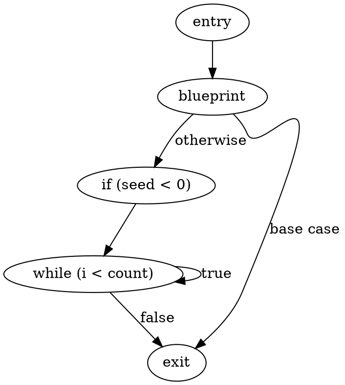
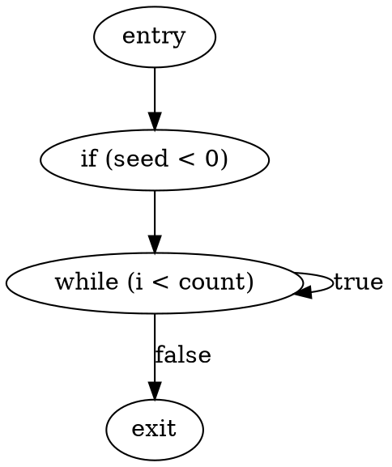
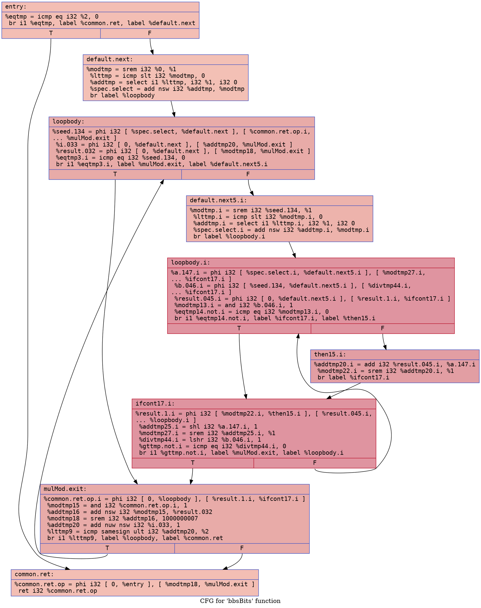
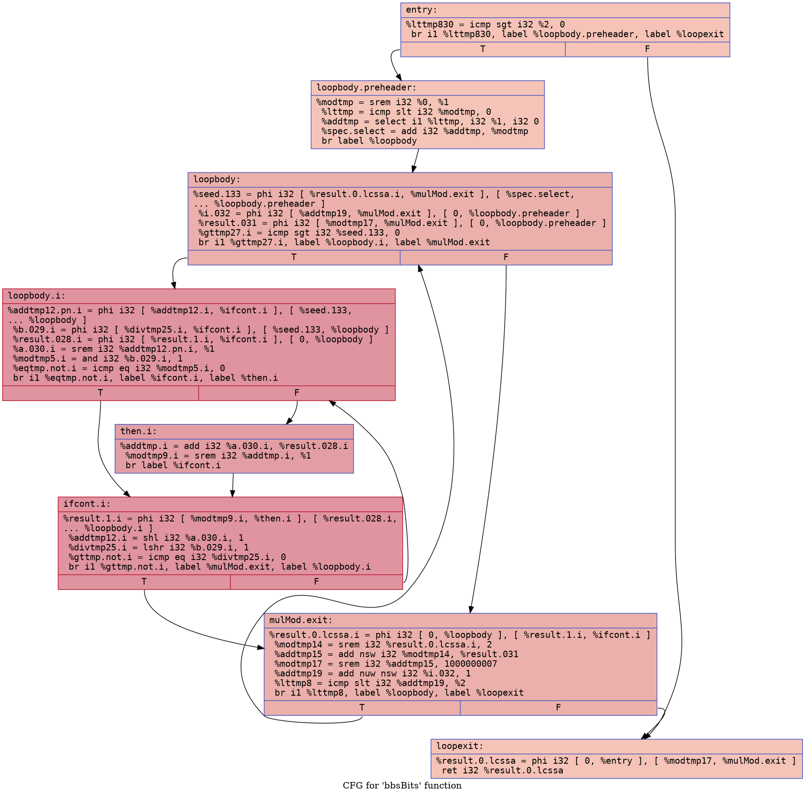

# BBS Bits Example

## `bbs_bits.bps`

### CFG (.dot)

### Cyclomatic Complexity
Cyclomatic Complexity = 4

## `bbs_bits-defensive.bps`

### CFG (.dot)

### Cyclomatic Complexity
Cyclomatic Complexity = 3

## `bbs_bits.ll`

### CFG (.dot)

### Cyclomatic Complexity
Number of Nodes =  9
Number of Edges = 13 
Cyclomatic Complexity = E - N + 2 = 13 - 9 + 2 = 6

## `bbs_bits-defensive.ll`

### CFG (.dot)

### Cyclomatic Complexity
Number of Nodes =  8
Number of Edges = 12 
Cyclomatic Complexity = E - N + 2 = 12 - 8 + 2 = 6
