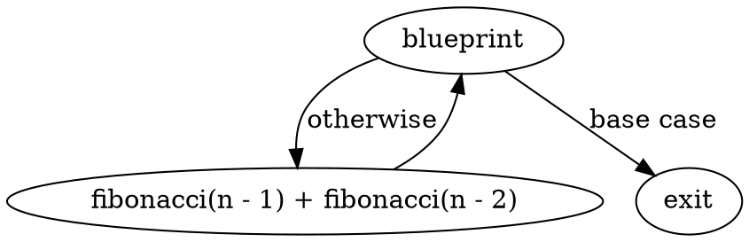
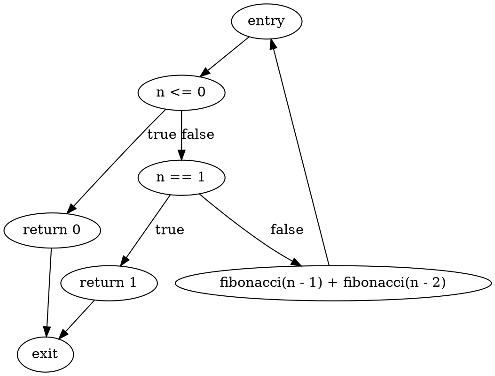
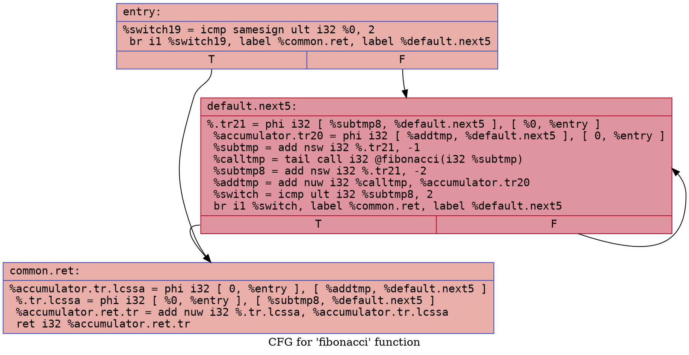
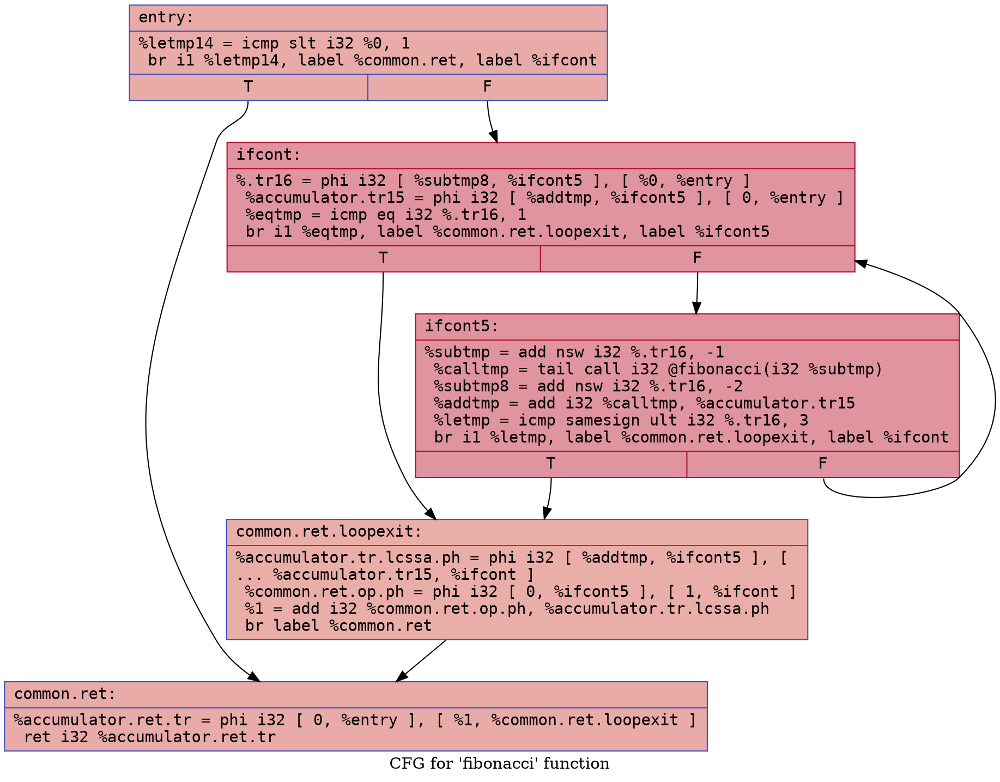

# Fibonacci Example

## `fibonacci.bps`

### CFG (.dot)

### Cyclomatic Complexity
Number of Nodes = 3
Number of Edges = 3
Cyclomatic Complexity = E - N + 2 = 3 - 3 + 2 = 2

## `fibonacci-defensive.bps`

### CFG (.dot)

### Cyclomatic Complexity
Number of Nodes = 7
Number of Edges = 8
Cyclomatic Complexity = E - N + 2 = 8 - 7 + 2 = 3

## `fibonacci.ll`

### CFG (.dot)

### Cyclomatic Complexity
Number of Nodes = 3
Number of Edges = 4
Cyclomatic Complexity = E - N + 2 = 4 - 3 + 2 = 3

## `fibonacci-defensive.ll`

### CFG (.dot)

### Cyclomatic Complexity
Number of Nodes = 5
Number of Edges = 7
Cyclomatic Complexity = E - N + 2 = 7 - 5 + 2 = 4
