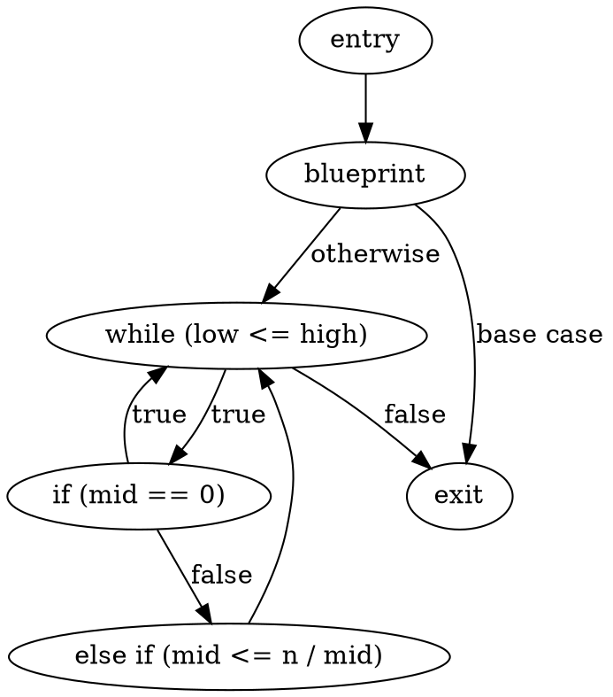
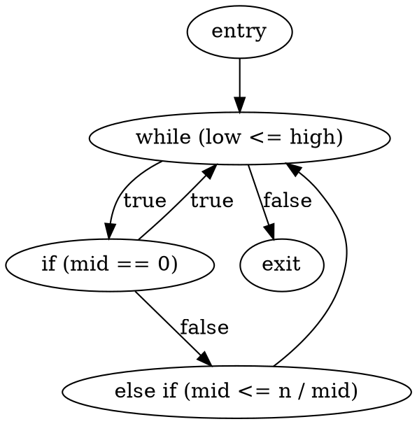
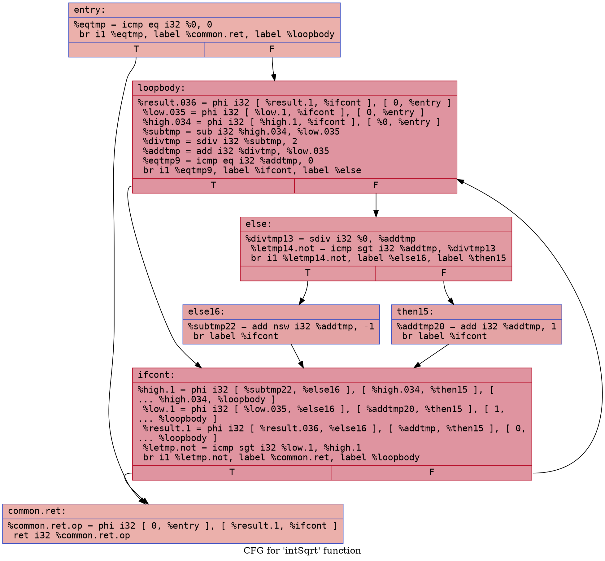
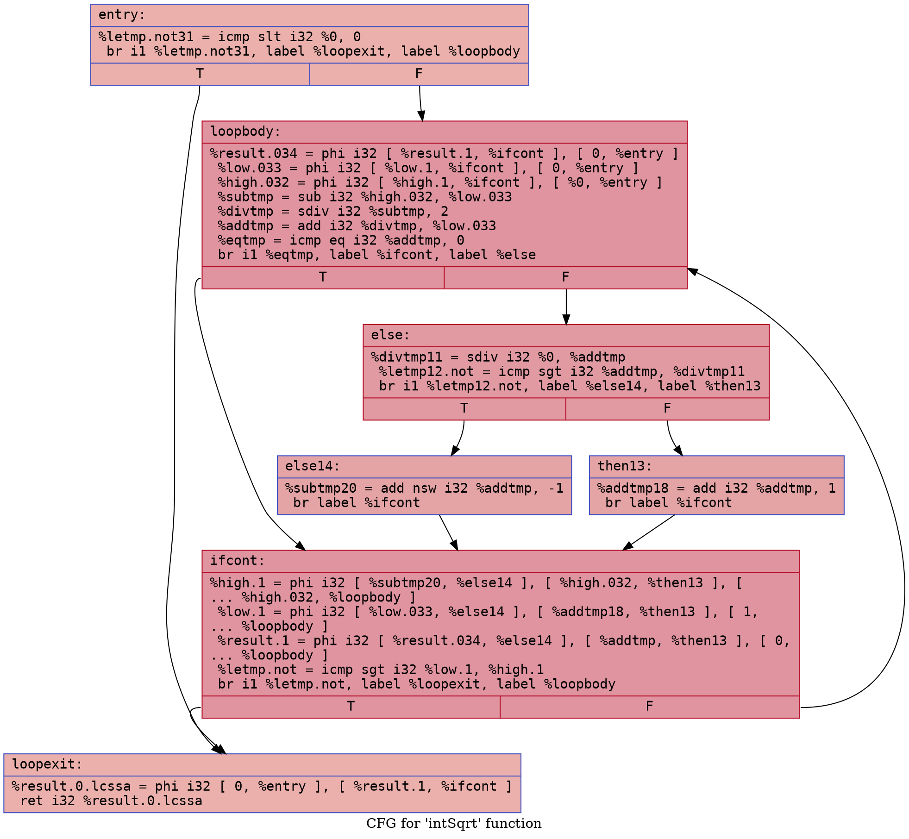

# Integer Square Root Example

## `int_sqrt.bps`

### CFG (.dot)

### Cyclomatic Complexity
Cyclomatic Complexity = 5

## `int_sqrt-defensive.bps`

### CFG (.dot)

### Cyclomatic Complexity
Cyclomatic Complexity = 4

## `int_sqrt.ll`

### CFG (.dot)

### Cyclomatic Complexity
Number of Nodes =  7
Number of Edges = 10 
Cyclomatic Complexity = E - N + 2 = 10 - 7 + 2 = 5

## `int_sqrt-defensive.ll`

### CFG (.dot)

### Cyclomatic Complexity
Number of Nodes =  7
Number of Edges = 10 
Cyclomatic Complexity = E - N + 2 = 10 - 7 + 2 = 5
