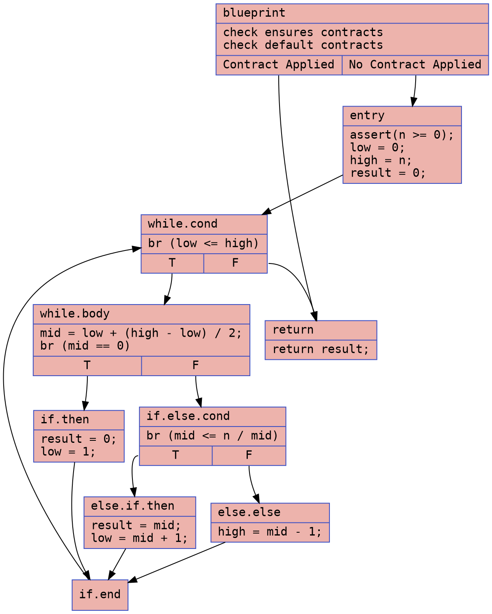
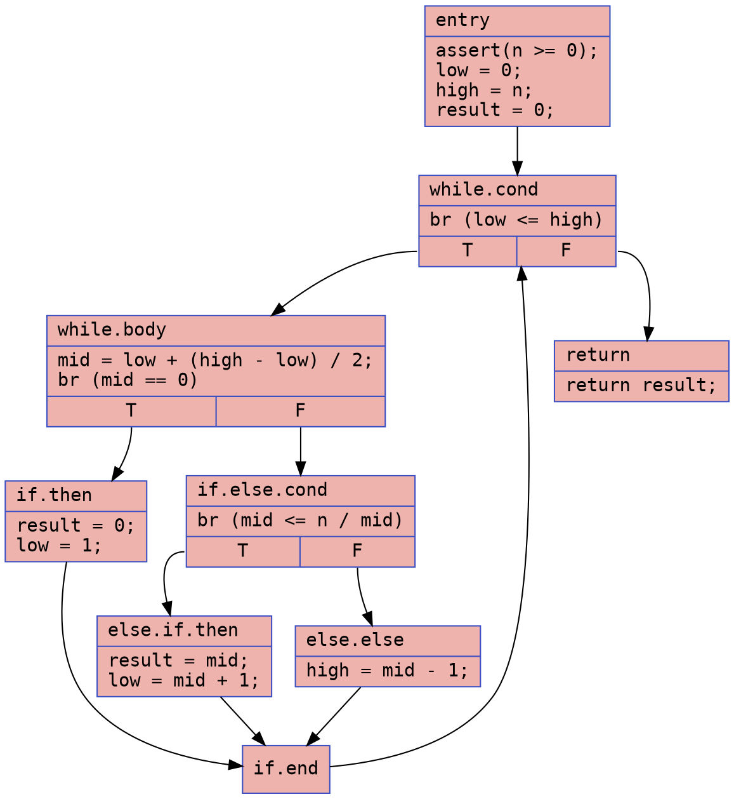
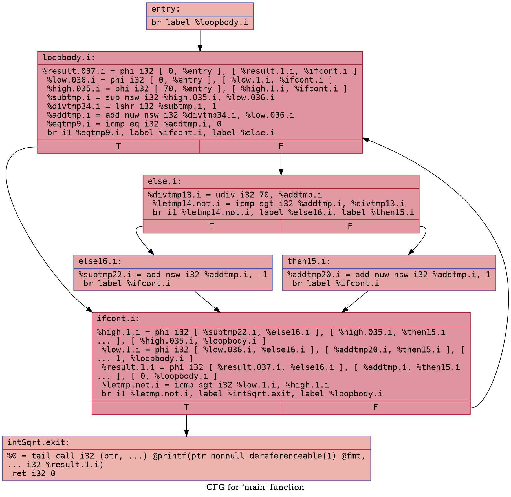
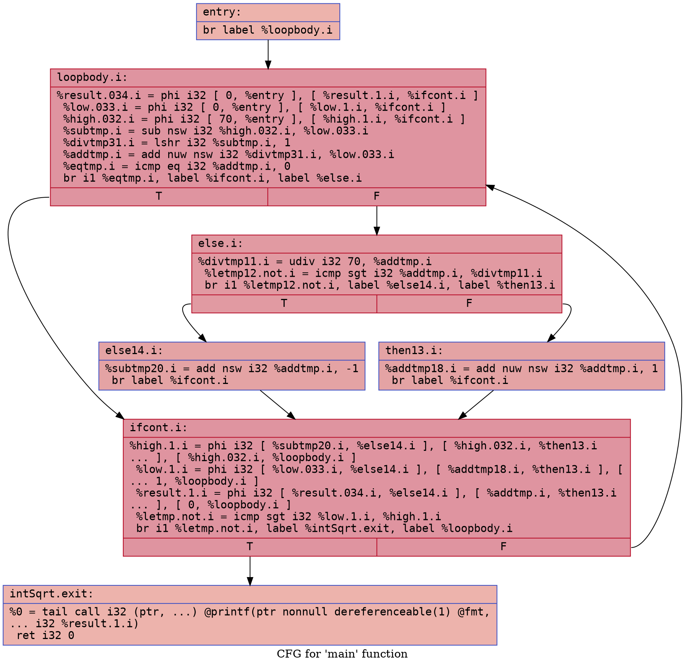

# Integer Square Root Example

### CFG (.dot)

### Cyclomatic Complexity
Number of Nodes = 10
Number of Edges = 13
Cyclomatic Complexity = E - N + 2 = 13 - 10 + 2 = 5

### CFG (.dot)

### Cyclomatic Complexity
Number of Nodes = 9
Number of Edges = 11
Cyclomatic Complexity = E - N + 2 = 11 - 9 + 2 = 4

## `int_sqrt.ll`

### CFG (.dot)

### Cyclomatic Complexity
Number of Nodes =  7
Number of Edges = 9
Cyclomatic Complexity = E - N + 2 = 9 - 7 + 2 = 4

## `int_sqrt-defensive.ll`

### CFG (.dot)

### Cyclomatic Complexity
Number of Nodes =  7
Number of Edges = 9
Cyclomatic Complexity = E - N + 2 = 9 - 7 + 2 = 4
