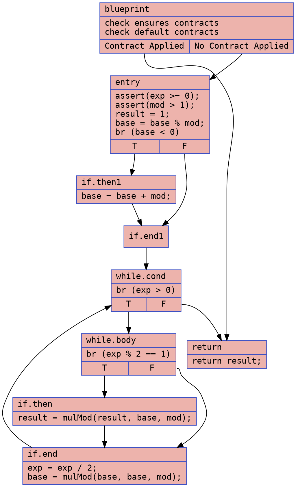
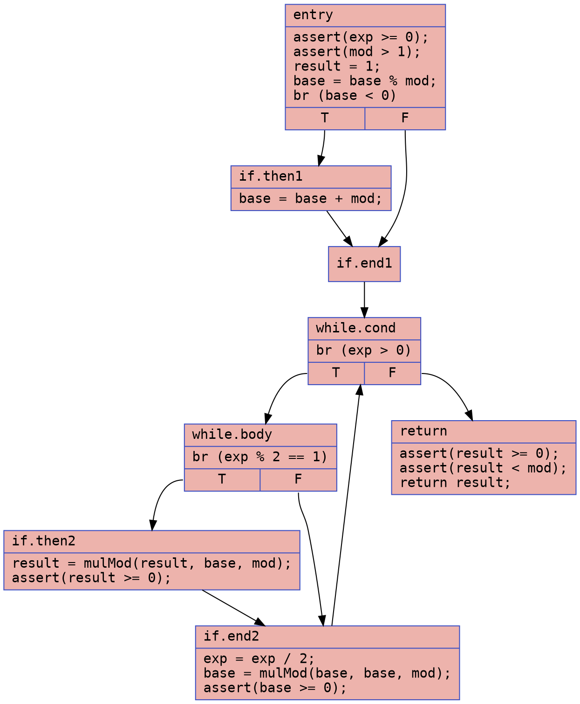
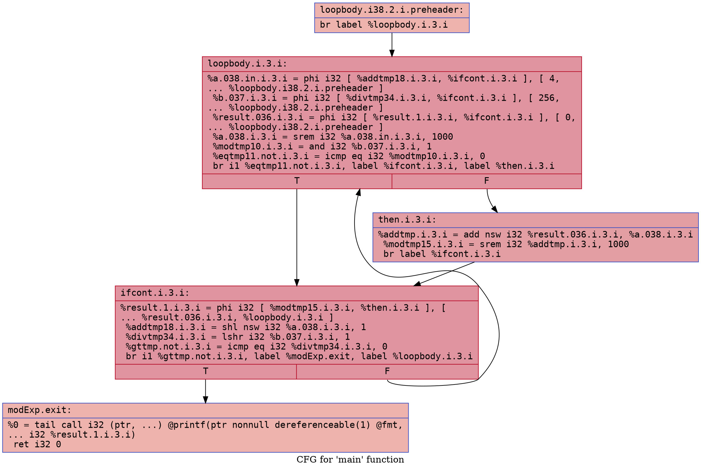
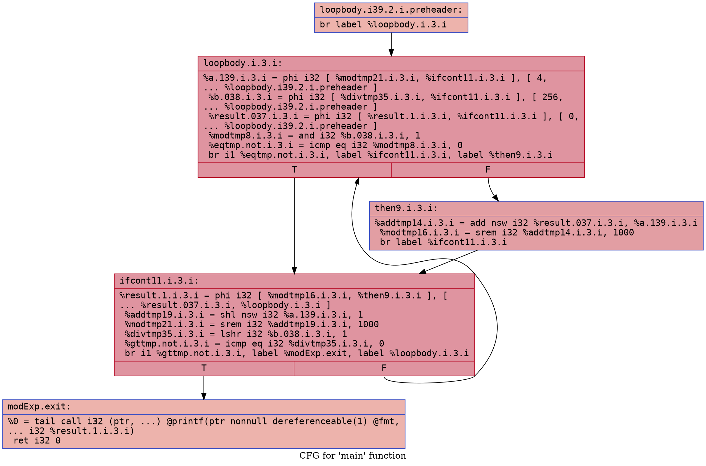

# Modular Exponentiation Example

### CFG (.dot)

### Cyclomatic Complexity
Number of Nodes = 9
Number of Edges = 12 
Cyclomatic Complexity = E - N + 2 = 12 - 9 + 2 = 5

### CFG (.dot)

### Cyclomatic Complexity
Number of Nodes = 8
Number of Edges = 10
Cyclomatic Complexity = E - N + 2 = 10 - 8 + 2 = 4

## `mod_exp.ll`

### CFG (.dot)

### Cyclomatic Complexity
Number of Nodes = 5
Number of Edges = 6
Cyclomatic Complexity = E - N + 2 = 6 - 5 + 2 = 3

## `mod_exp-defensive.ll`

### CFG (.dot)

### Cyclomatic Complexity
Number of Nodes = 5
Number of Edges = 6
Cyclomatic Complexity = E - N + 2 = 6 - 5 + 2 = 3
