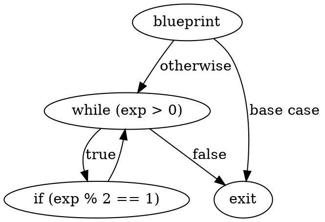
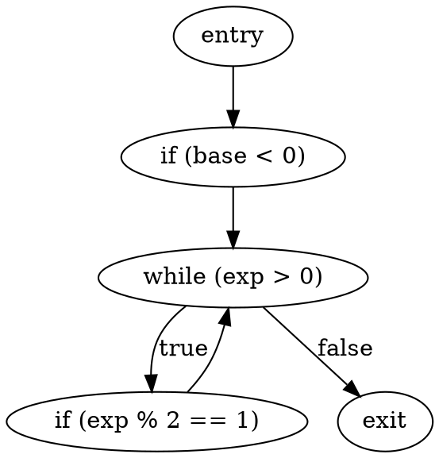
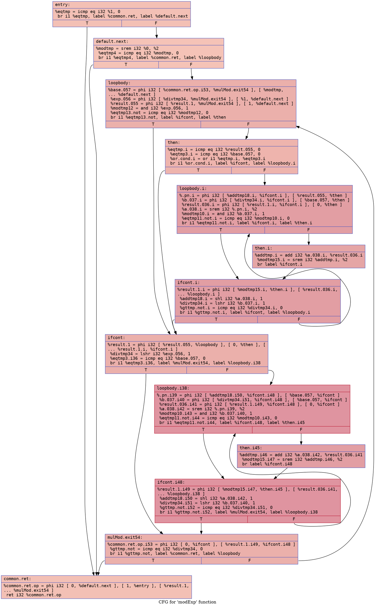

```dot
digraph "CFG for 'modExp' function" {
	label="CFG for 'modExp' function";

	Node0x562cafc80c80 [shape=record,color="#3d50c3ff", style=filled, fillcolor="#e5705870", fontname="Courier",label="{entry:\l|  %gttmp61 = icmp sgt i32 %1, 0\l  br i1 %gttmp61, label %loopbody.preheader, label %loopexit\l|{<s0>T|<s1>F}}"];
	Node0x562cafc80c80:s0 -> Node0x562cafc80950;
	Node0x562cafc80c80:s1 -> Node0x562cafc81a80;
	Node0x562cafc80950 [shape=record,color="#3d50c3ff", style=filled, fillcolor="#e97a5f70", fontname="Courier",label="{loopbody.preheader:\l|  %modtmp = srem i32 %0, %2\l  %lttmp = icmp slt i32 %modtmp, 0\l  %addtmp = select i1 %lttmp, i32 %2, i32 0\l  %spec.select = add i32 %addtmp, %modtmp\l  br label %loopbody\l}"];
	Node0x562cafc80950 -> Node0x562cafc80e20;
	Node0x562cafc80e20 [shape=record,color="#3d50c3ff", style=filled, fillcolor="#d0473d70", fontname="Courier",label="{loopbody:\l|  %base.164 = phi i32 [ %result.0.lcssa.i34, %mulMod.exit55 ], [\l... %spec.select, %loopbody.preheader ]\l  %exp.063 = phi i32 [ %divtmp3260, %mulMod.exit55 ], [ %1,\l... %loopbody.preheader ]\l  %result.062 = phi i32 [ %result.159, %mulMod.exit55 ], [ 1,\l... %loopbody.preheader ]\l  %modtmp8 = and i32 %exp.063, 1\l  %eqtmp.not = icmp eq i32 %modtmp8, 0\l  br i1 %eqtmp.not, label %ifcont11, label %then9\l|{<s0>T|<s1>F}}"];
	Node0x562cafc80e20:s0 -> Node0x562cafc826d0;
	Node0x562cafc80e20:s1 -> Node0x562cafc827c0;
	Node0x562cafc81a80 [shape=record,color="#3d50c3ff", style=filled, fillcolor="#e5705870", fontname="Courier",label="{loopexit:\l|  %result.0.lcssa = phi i32 [ 1, %entry ], [ %result.159, %mulMod.exit55 ]\l  ret i32 %result.0.lcssa\l}"];
	Node0x562cafc827c0 [shape=record,color="#3d50c3ff", style=filled, fillcolor="#d6524470", fontname="Courier",label="{then9:\l|  %gttmp36.i = icmp sgt i32 %base.164, 0\l  br i1 %gttmp36.i, label %loopbody.preheader.i, label %mulMod.exit55\l|{<s0>T|<s1>F}}"];
	Node0x562cafc827c0:s0 -> Node0x562cafc82840;
	Node0x562cafc827c0:s1 -> Node0x562cafc81ec0;
	Node0x562cafc82840 [shape=record,color="#3d50c3ff", style=filled, fillcolor="#d8564670", fontname="Courier",label="{loopbody.preheader.i:\l|  %modtmp.i = srem i32 %result.062, %2\l  %lttmp.i = icmp slt i32 %modtmp.i, 0\l  %addtmp.i = select i1 %lttmp.i, i32 %2, i32 0\l  %spec.select.i = add i32 %addtmp.i, %modtmp.i\l  br label %loopbody.i\l}"];
	Node0x562cafc82840 -> Node0x562cafc83380;
	Node0x562cafc83380 [shape=record,color="#b70d28ff", style=filled, fillcolor="#bb1b2c70", fontname="Courier",label="{loopbody.i:\l|  %a.139.i = phi i32 [ %modtmp21.i, %ifcont11.i ], [ %spec.select.i,\l... %loopbody.preheader.i ]\l  %b.038.i = phi i32 [ %divtmp35.i, %ifcont11.i ], [ %base.164,\l... %loopbody.preheader.i ]\l  %result.037.i = phi i32 [ %result.1.i, %ifcont11.i ], [ 0,\l... %loopbody.preheader.i ]\l  %modtmp8.i = and i32 %b.038.i, 1\l  %eqtmp.not.i = icmp eq i32 %modtmp8.i, 0\l  br i1 %eqtmp.not.i, label %ifcont11.i, label %then9.i\l|{<s0>T|<s1>F}}"];
	Node0x562cafc83380:s0 -> Node0x562cafc83bf0;
	Node0x562cafc83380:s1 -> Node0x562cafc84290;
	Node0x562cafc84290 [shape=record,color="#3d50c3ff", style=filled, fillcolor="#c32e3170", fontname="Courier",label="{then9.i:\l|  %addtmp14.i = add i32 %result.037.i, %a.139.i\l  %modtmp16.i = srem i32 %addtmp14.i, %2\l  br label %ifcont11.i\l}"];
	Node0x562cafc84290 -> Node0x562cafc83bf0;
	Node0x562cafc83bf0 [shape=record,color="#b70d28ff", style=filled, fillcolor="#bb1b2c70", fontname="Courier",label="{ifcont11.i:\l|  %result.1.i = phi i32 [ %modtmp16.i, %then9.i ], [ %result.037.i,\l... %loopbody.i ]\l  %addtmp19.i = shl i32 %a.139.i, 1\l  %modtmp21.i = srem i32 %addtmp19.i, %2\l  %divtmp35.i = lshr i32 %b.038.i, 1\l  %gttmp.not.i = icmp eq i32 %divtmp35.i, 0\l  br i1 %gttmp.not.i, label %ifcont11, label %loopbody.i\l|{<s0>T|<s1>F}}"];
	Node0x562cafc83bf0:s0 -> Node0x562cafc826d0;
	Node0x562cafc83bf0:s1 -> Node0x562cafc83380;
	Node0x562cafc826d0 [shape=record,color="#3d50c3ff", style=filled, fillcolor="#d24b4070", fontname="Courier",label="{ifcont11:\l|  %result.1 = phi i32 [ %result.062, %loopbody ], [ %result.1.i, %ifcont11.i\l... ]\l  %gttmp36.i33 = icmp sgt i32 %base.164, 0\l  br i1 %gttmp36.i33, label %loopbody.i40, label %mulMod.exit55\l|{<s0>T|<s1>F}}"];
	Node0x562cafc826d0:s0 -> Node0x562cafc83af0;
	Node0x562cafc826d0:s1 -> Node0x562cafc81ec0;
	Node0x562cafc83af0 [shape=record,color="#b70d28ff", style=filled, fillcolor="#b70d2870", fontname="Courier",label="{loopbody.i40:\l|  %addtmp19.i51.pn = phi i32 [ %addtmp19.i51, %ifcont11.i49 ], [ %base.164,\l... %ifcont11 ]\l  %b.038.i42 = phi i32 [ %divtmp35.i53, %ifcont11.i49 ], [ %base.164,\l... %ifcont11 ]\l  %result.037.i43 = phi i32 [ %result.1.i50, %ifcont11.i49 ], [ 0, %ifcont11 ]\l  %a.139.i41 = srem i32 %addtmp19.i51.pn, %2\l  %modtmp8.i44 = and i32 %b.038.i42, 1\l  %eqtmp.not.i45 = icmp eq i32 %modtmp8.i44, 0\l  br i1 %eqtmp.not.i45, label %ifcont11.i49, label %then9.i46\l|{<s0>T|<s1>F}}"];
	Node0x562cafc83af0:s0 -> Node0x562cafc84b00;
	Node0x562cafc83af0:s1 -> Node0x562cafc858a0;
	Node0x562cafc858a0 [shape=record,color="#3d50c3ff", style=filled, fillcolor="#be242e70", fontname="Courier",label="{then9.i46:\l|  %addtmp14.i47 = add i32 %a.139.i41, %result.037.i43\l  %modtmp16.i48 = srem i32 %addtmp14.i47, %2\l  br label %ifcont11.i49\l}"];
	Node0x562cafc858a0 -> Node0x562cafc84b00;
	Node0x562cafc84b00 [shape=record,color="#b70d28ff", style=filled, fillcolor="#b70d2870", fontname="Courier",label="{ifcont11.i49:\l|  %result.1.i50 = phi i32 [ %modtmp16.i48, %then9.i46 ], [ %result.037.i43,\l... %loopbody.i40 ]\l  %addtmp19.i51 = shl i32 %a.139.i41, 1\l  %divtmp35.i53 = lshr i32 %b.038.i42, 1\l  %gttmp.not.i54 = icmp eq i32 %divtmp35.i53, 0\l  br i1 %gttmp.not.i54, label %mulMod.exit55, label %loopbody.i40\l|{<s0>T|<s1>F}}"];
	Node0x562cafc84b00:s0 -> Node0x562cafc81ec0;
	Node0x562cafc84b00:s1 -> Node0x562cafc83af0;
	Node0x562cafc81ec0 [shape=record,color="#3d50c3ff", style=filled, fillcolor="#d0473d70", fontname="Courier",label="{mulMod.exit55:\l|  %result.159 = phi i32 [ %result.1, %ifcont11 ], [ 0, %then9 ], [\l... %result.1, %ifcont11.i49 ]\l  %result.0.lcssa.i34 = phi i32 [ 0, %ifcont11 ], [ 0, %then9 ], [\l... %result.1.i50, %ifcont11.i49 ]\l  %divtmp3260 = lshr i32 %exp.063, 1\l  %gttmp.not = icmp eq i32 %divtmp3260, 0\l  br i1 %gttmp.not, label %loopexit, label %loopbody\l|{<s0>T|<s1>F}}"];
	Node0x562cafc81ec0:s0 -> Node0x562cafc81a80;
	Node0x562cafc81ec0:s1 -> Node0x562cafc80e20;
}
```

# Modular Exponentiation Example

## `mod_exp.bps`

### CFG (.dot)

### Cyclomatic Complexity
Number of Nodes = 4
Number of Edges = 5
Cyclomatic Complexity = E - N + 2 = 5 - 4 + 2 = 3

## `mod_exp-defensive.bps`

### CFG (.dot)

### Cyclomatic Complexity
Number of Nodes = 5
Number of Edges = 5
Cyclomatic Complexity = E - N + 2 = 5 - 5 + 2 = 2

## `mod_exp.ll`

### CFG (.dot)

### Cyclomatic Complexity
Number of Nodes = 12 
Number of Edges = 21 
Cyclomatic Complexity = E - N + 2 = 21 - 12 + 2 = 11

## `mod_exp-defensive.ll`

### CFG (.dot)

### Cyclomatic Complexity
Number of Nodes = 12 
Number of Edges = 22 
Cyclomatic Complexity = E - N + 2 = 22 - 12 + 2 = 12
