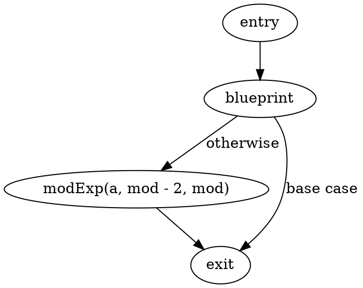
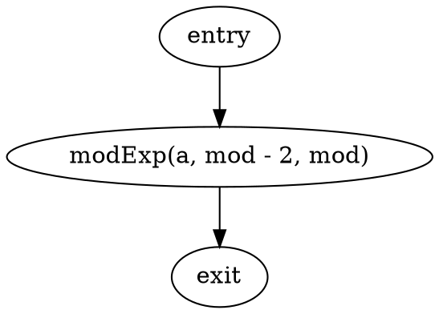

```dot
digraph "CFG for 'modInverse' function" {
	label="CFG for 'modInverse' function";

	Node0x563866fcc390 [shape=record,color="#3d50c3ff", style=filled, fillcolor="#e1675170", fontname="Courier",label="{entry:\l|  %modtmp = srem i32 %0, %1\l  %eqtmp = icmp eq i32 %modtmp, 0\l  br i1 %eqtmp, label %common.ret, label %default.next\l|{<s0>T|<s1>F}}"];
	Node0x563866fcc390:s0 -> Node0x563866fcdaf0;
	Node0x563866fcc390:s1 -> Node0x563867001270;
	Node0x563866fcdaf0 [shape=record,color="#3d50c3ff", style=filled, fillcolor="#e1675170", fontname="Courier",label="{common.ret:\l|  %common.ret.op = phi i32 [ 0, %entry ], [ 1, %default.next ], [\l... %result.1.i, %mulMod.exit57.i ]\l  ret i32 %common.ret.op\l}"];
	Node0x563867001270 [shape=record,color="#3d50c3ff", style=filled, fillcolor="#e36c5570", fontname="Courier",label="{default.next:\l|  %subtmp = add nsw i32 %1, -2\l  %eqtmp.i = icmp eq i32 %subtmp, 0\l  br i1 %eqtmp.i, label %common.ret, label %default.next.i\l|{<s0>T|<s1>F}}"];
	Node0x563867001270:s0 -> Node0x563866fcdaf0;
	Node0x563867001270:s1 -> Node0x563866fcb2f0;
	Node0x563866fcb2f0 [shape=record,color="#3d50c3ff", style=filled, fillcolor="#e5705870", fontname="Courier",label="{default.next.i:\l|  %lttmp.i = icmp slt i32 %modtmp, 0\l  %addtmp.i = select i1 %lttmp.i, i32 %1, i32 0\l  %spec.select.i = add nsw i32 %addtmp.i, %modtmp\l  br label %loopbody.i\l}"];
	Node0x563866fcb2f0 -> Node0x563866fcb890;
	Node0x563866fcb890 [shape=record,color="#3d50c3ff", style=filled, fillcolor="#cc403a70", fontname="Courier",label="{loopbody.i:\l|  %base.160.i = phi i32 [ %spec.select.i, %default.next.i ], [\l... %common.ret.op.i56.i, %mulMod.exit57.i ]\l  %exp.059.i = phi i32 [ %subtmp, %default.next.i ], [ %divtmp35.i,\l... %mulMod.exit57.i ]\l  %result.058.i = phi i32 [ 1, %default.next.i ], [ %result.1.i,\l... %mulMod.exit57.i ]\l  %modtmp9.i = and i32 %exp.059.i, 1\l  %eqtmp10.not.i = icmp eq i32 %modtmp9.i, 0\l  br i1 %eqtmp10.not.i, label %ifcont13.i, label %then11.i\l|{<s0>T|<s1>F}}"];
	Node0x563866fcb890:s0 -> Node0x5638670030a0;
	Node0x563866fcb890:s1 -> Node0x563867003190;
	Node0x563867003190 [shape=record,color="#3d50c3ff", style=filled, fillcolor="#d24b4070", fontname="Courier",label="{then11.i:\l|  %eqtmp.i.i = icmp eq i32 %result.058.i, 0\l  %eqtmp3.i.i = icmp eq i32 %base.160.i, 0\l  %or.cond.i.i = or i1 %eqtmp3.i.i, %eqtmp.i.i\l  br i1 %or.cond.i.i, label %ifcont13.i, label %loopbody.i.i\l|{<s0>T|<s1>F}}"];
	Node0x563867003190:s0 -> Node0x5638670030a0;
	Node0x563867003190:s1 -> Node0x563867003220;
	Node0x563867003220 [shape=record,color="#b70d28ff", style=filled, fillcolor="#bb1b2c70", fontname="Courier",label="{loopbody.i.i:\l|  %result.0.pn.i = phi i32 [ %addtmp25.i.i, %ifcont17.i.i ], [\l... %result.058.i, %then11.i ]\l  %b.046.i.i = phi i32 [ %divtmp44.i.i, %ifcont17.i.i ], [ %base.160.i,\l... %then11.i ]\l  %result.045.i.i = phi i32 [ %result.1.i.i, %ifcont17.i.i ], [ 0, %then11.i ]\l  %a.147.i.i = srem i32 %result.0.pn.i, %1\l  %modtmp13.i.i = and i32 %b.046.i.i, 1\l  %eqtmp14.not.i.i = icmp eq i32 %modtmp13.i.i, 0\l  br i1 %eqtmp14.not.i.i, label %ifcont17.i.i, label %then15.i.i\l|{<s0>T|<s1>F}}"];
	Node0x563867003220:s0 -> Node0x563867003710;
	Node0x563867003220:s1 -> Node0x563867003ec0;
	Node0x563867003ec0 [shape=record,color="#3d50c3ff", style=filled, fillcolor="#c32e3170", fontname="Courier",label="{then15.i.i:\l|  %addtmp20.i.i = add i32 %a.147.i.i, %result.045.i.i\l  %modtmp22.i.i = srem i32 %addtmp20.i.i, %1\l  br label %ifcont17.i.i\l}"];
	Node0x563867003ec0 -> Node0x563867003710;
	Node0x563867003710 [shape=record,color="#b70d28ff", style=filled, fillcolor="#bb1b2c70", fontname="Courier",label="{ifcont17.i.i:\l|  %result.1.i.i = phi i32 [ %modtmp22.i.i, %then15.i.i ], [ %result.045.i.i,\l... %loopbody.i.i ]\l  %addtmp25.i.i = shl i32 %a.147.i.i, 1\l  %divtmp44.i.i = lshr i32 %b.046.i.i, 1\l  %gttmp.not.i.i = icmp eq i32 %divtmp44.i.i, 0\l  br i1 %gttmp.not.i.i, label %ifcont13.i, label %loopbody.i.i\l|{<s0>T|<s1>F}}"];
	Node0x563867003710:s0 -> Node0x5638670030a0;
	Node0x563867003710:s1 -> Node0x563867003220;
	Node0x5638670030a0 [shape=record,color="#3d50c3ff", style=filled, fillcolor="#cc403a70", fontname="Courier",label="{ifcont13.i:\l|  %result.1.i = phi i32 [ %result.058.i, %loopbody.i ], [ 0, %then11.i ], [\l... %result.1.i.i, %ifcont17.i.i ]\l  %divtmp35.i = lshr i32 %exp.059.i, 1\l  %eqtmp3.i37.i = icmp eq i32 %base.160.i, 0\l  br i1 %eqtmp3.i37.i, label %mulMod.exit57.i, label %default.next5.i39.i\l|{<s0>T|<s1>F}}"];
	Node0x5638670030a0:s0 -> Node0x563866fcb460;
	Node0x5638670030a0:s1 -> Node0x563867002ce0;
	Node0x563867002ce0 [shape=record,color="#3d50c3ff", style=filled, fillcolor="#d6524470", fontname="Courier",label="{default.next5.i39.i:\l|  %modtmp.i40.i = srem i32 %base.160.i, %1\l  %lttmp.i.i = icmp slt i32 %modtmp.i40.i, 0\l  %addtmp.i.i = select i1 %lttmp.i.i, i32 %1, i32 0\l  %spec.select.i.i = add nsw i32 %addtmp.i.i, %modtmp.i40.i\l  br label %loopbody.i41.i\l}"];
	Node0x563867002ce0 -> Node0x563867001210;
	Node0x563867001210 [shape=record,color="#b70d28ff", style=filled, fillcolor="#b70d2870", fontname="Courier",label="{loopbody.i41.i:\l|  %a.147.i42.i = phi i32 [ %spec.select.i.i, %default.next5.i39.i ], [\l... %modtmp27.i53.i, %ifcont17.i50.i ]\l  %b.046.i43.i = phi i32 [ %base.160.i, %default.next5.i39.i ], [\l... %divtmp44.i54.i, %ifcont17.i50.i ]\l  %result.045.i44.i = phi i32 [ 0, %default.next5.i39.i ], [ %result.1.i51.i,\l... %ifcont17.i50.i ]\l  %modtmp13.i45.i = and i32 %b.046.i43.i, 1\l  %eqtmp14.not.i46.i = icmp eq i32 %modtmp13.i45.i, 0\l  br i1 %eqtmp14.not.i46.i, label %ifcont17.i50.i, label %then15.i47.i\l|{<s0>T|<s1>F}}"];
	Node0x563867001210:s0 -> Node0x5638670035a0;
	Node0x563867001210:s1 -> Node0x563867005760;
	Node0x563867005760 [shape=record,color="#3d50c3ff", style=filled, fillcolor="#be242e70", fontname="Courier",label="{then15.i47.i:\l|  %addtmp20.i48.i = add i32 %result.045.i44.i, %a.147.i42.i\l  %modtmp22.i49.i = srem i32 %addtmp20.i48.i, %1\l  br label %ifcont17.i50.i\l}"];
	Node0x563867005760 -> Node0x5638670035a0;
	Node0x5638670035a0 [shape=record,color="#b70d28ff", style=filled, fillcolor="#b70d2870", fontname="Courier",label="{ifcont17.i50.i:\l|  %result.1.i51.i = phi i32 [ %modtmp22.i49.i, %then15.i47.i ], [\l... %result.045.i44.i, %loopbody.i41.i ]\l  %addtmp25.i52.i = shl i32 %a.147.i42.i, 1\l  %modtmp27.i53.i = srem i32 %addtmp25.i52.i, %1\l  %divtmp44.i54.i = lshr i32 %b.046.i43.i, 1\l  %gttmp.not.i55.i = icmp eq i32 %divtmp44.i54.i, 0\l  br i1 %gttmp.not.i55.i, label %mulMod.exit57.i, label %loopbody.i41.i\l|{<s0>T|<s1>F}}"];
	Node0x5638670035a0:s0 -> Node0x563866fcb460;
	Node0x5638670035a0:s1 -> Node0x563867001210;
	Node0x563866fcb460 [shape=record,color="#3d50c3ff", style=filled, fillcolor="#cc403a70", fontname="Courier",label="{mulMod.exit57.i:\l|  %common.ret.op.i56.i = phi i32 [ 0, %ifcont13.i ], [ %result.1.i51.i,\l... %ifcont17.i50.i ]\l  %gttmp.not.i = icmp eq i32 %divtmp35.i, 0\l  br i1 %gttmp.not.i, label %common.ret, label %loopbody.i\l|{<s0>T|<s1>F}}"];
	Node0x563866fcb460:s0 -> Node0x563866fcdaf0;
	Node0x563866fcb460:s1 -> Node0x563866fcb890;
}
```

```dot
digraph "CFG for 'modInverse' function" {
	label="CFG for 'modInverse' function";

	Node0x564e76a673e0 [shape=record,color="#3d50c3ff", style=filled, fillcolor="#e5705870", fontname="Courier",label="{entry:\l|  %subtmp = add i32 %1, -2\l  %gttmp61.i = icmp sgt i32 %subtmp, 0\l  br i1 %gttmp61.i, label %loopbody.preheader.i, label %modExp.exit\l|{<s0>T|<s1>F}}"];
	Node0x564e76a673e0:s0 -> Node0x564e76a6a3b0;
	Node0x564e76a673e0:s1 -> Node0x564e76a6a560;
	Node0x564e76a6a3b0 [shape=record,color="#3d50c3ff", style=filled, fillcolor="#e97a5f70", fontname="Courier",label="{loopbody.preheader.i:\l|  %modtmp.i = srem i32 %0, %1\l  %lttmp.i = icmp slt i32 %modtmp.i, 0\l  %addtmp.i = select i1 %lttmp.i, i32 %1, i32 0\l  %spec.select.i = add i32 %addtmp.i, %modtmp.i\l  br label %loopbody.i\l}"];
	Node0x564e76a6a3b0 -> Node0x564e76a69630;
	Node0x564e76a69630 [shape=record,color="#3d50c3ff", style=filled, fillcolor="#d0473d70", fontname="Courier",label="{loopbody.i:\l|  %base.164.i = phi i32 [ %result.0.lcssa.i34.i, %mulMod.exit55.i ], [\l... %spec.select.i, %loopbody.preheader.i ]\l  %exp.063.i = phi i32 [ %divtmp3260.i, %mulMod.exit55.i ], [ %subtmp,\l... %loopbody.preheader.i ]\l  %result.062.i = phi i32 [ %result.159.i, %mulMod.exit55.i ], [ 1,\l... %loopbody.preheader.i ]\l  %modtmp8.i = and i32 %exp.063.i, 1\l  %eqtmp.not.i = icmp eq i32 %modtmp8.i, 0\l  br i1 %eqtmp.not.i, label %ifcont11.i, label %then9.i\l|{<s0>T|<s1>F}}"];
	Node0x564e76a69630:s0 -> Node0x564e76a9f900;
	Node0x564e76a69630:s1 -> Node0x564e76a9f9c0;
	Node0x564e76a9f9c0 [shape=record,color="#3d50c3ff", style=filled, fillcolor="#d6524470", fontname="Courier",label="{then9.i:\l|  %gttmp36.i.i = icmp sgt i32 %base.164.i, 0\l  br i1 %gttmp36.i.i, label %loopbody.preheader.i.i, label %mulMod.exit55.i\l|{<s0>T|<s1>F}}"];
	Node0x564e76a9f9c0:s0 -> Node0x564e76a9fa20;
	Node0x564e76a9f9c0:s1 -> Node0x564e76a681a0;
	Node0x564e76a9fa20 [shape=record,color="#3d50c3ff", style=filled, fillcolor="#d8564670", fontname="Courier",label="{loopbody.preheader.i.i:\l|  %modtmp.i.i = srem i32 %result.062.i, %1\l  %lttmp.i.i = icmp slt i32 %modtmp.i.i, 0\l  %addtmp.i.i = select i1 %lttmp.i.i, i32 %1, i32 0\l  %spec.select.i.i = add i32 %addtmp.i.i, %modtmp.i.i\l  br label %loopbody.i.i\l}"];
	Node0x564e76a9fa20 -> Node0x564e76a9fc50;
	Node0x564e76a9fc50 [shape=record,color="#b70d28ff", style=filled, fillcolor="#bb1b2c70", fontname="Courier",label="{loopbody.i.i:\l|  %a.139.i.i = phi i32 [ %modtmp21.i.i, %ifcont11.i.i ], [ %spec.select.i.i,\l... %loopbody.preheader.i.i ]\l  %b.038.i.i = phi i32 [ %divtmp35.i.i, %ifcont11.i.i ], [ %base.164.i,\l... %loopbody.preheader.i.i ]\l  %result.037.i.i = phi i32 [ %result.1.i.i, %ifcont11.i.i ], [ 0,\l... %loopbody.preheader.i.i ]\l  %modtmp8.i.i = and i32 %b.038.i.i, 1\l  %eqtmp.not.i.i = icmp eq i32 %modtmp8.i.i, 0\l  br i1 %eqtmp.not.i.i, label %ifcont11.i.i, label %then9.i.i\l|{<s0>T|<s1>F}}"];
	Node0x564e76a9fc50:s0 -> Node0x564e76aa01b0;
	Node0x564e76a9fc50:s1 -> Node0x564e76aa0870;
	Node0x564e76aa0870 [shape=record,color="#3d50c3ff", style=filled, fillcolor="#c32e3170", fontname="Courier",label="{then9.i.i:\l|  %addtmp14.i.i = add i32 %result.037.i.i, %a.139.i.i\l  %modtmp16.i.i = srem i32 %addtmp14.i.i, %1\l  br label %ifcont11.i.i\l}"];
	Node0x564e76aa0870 -> Node0x564e76aa01b0;
	Node0x564e76aa01b0 [shape=record,color="#b70d28ff", style=filled, fillcolor="#bb1b2c70", fontname="Courier",label="{ifcont11.i.i:\l|  %result.1.i.i = phi i32 [ %modtmp16.i.i, %then9.i.i ], [ %result.037.i.i,\l... %loopbody.i.i ]\l  %addtmp19.i.i = shl i32 %a.139.i.i, 1\l  %modtmp21.i.i = srem i32 %addtmp19.i.i, %1\l  %divtmp35.i.i = lshr i32 %b.038.i.i, 1\l  %gttmp.not.i.i = icmp eq i32 %divtmp35.i.i, 0\l  br i1 %gttmp.not.i.i, label %ifcont11.i, label %loopbody.i.i\l|{<s0>T|<s1>F}}"];
	Node0x564e76aa01b0:s0 -> Node0x564e76a9f900;
	Node0x564e76aa01b0:s1 -> Node0x564e76a9fc50;
	Node0x564e76a9f900 [shape=record,color="#3d50c3ff", style=filled, fillcolor="#d24b4070", fontname="Courier",label="{ifcont11.i:\l|  %result.1.i = phi i32 [ %result.062.i, %loopbody.i ], [ %result.1.i.i,\l... %ifcont11.i.i ]\l  %gttmp36.i33.i = icmp sgt i32 %base.164.i, 0\l  br i1 %gttmp36.i33.i, label %loopbody.i40.i, label %mulMod.exit55.i\l|{<s0>T|<s1>F}}"];
	Node0x564e76a9f900:s0 -> Node0x564e76aa00b0;
	Node0x564e76a9f900:s1 -> Node0x564e76a681a0;
	Node0x564e76aa00b0 [shape=record,color="#b70d28ff", style=filled, fillcolor="#b70d2870", fontname="Courier",label="{loopbody.i40.i:\l|  %addtmp19.i51.pn.i = phi i32 [ %addtmp19.i51.i, %ifcont11.i49.i ], [\l... %base.164.i, %ifcont11.i ]\l  %b.038.i42.i = phi i32 [ %divtmp35.i53.i, %ifcont11.i49.i ], [ %base.164.i,\l... %ifcont11.i ]\l  %result.037.i43.i = phi i32 [ %result.1.i50.i, %ifcont11.i49.i ], [ 0,\l... %ifcont11.i ]\l  %a.139.i41.i = srem i32 %addtmp19.i51.pn.i, %1\l  %modtmp8.i44.i = and i32 %b.038.i42.i, 1\l  %eqtmp.not.i45.i = icmp eq i32 %modtmp8.i44.i, 0\l  br i1 %eqtmp.not.i45.i, label %ifcont11.i49.i, label %then9.i46.i\l|{<s0>T|<s1>F}}"];
	Node0x564e76aa00b0:s0 -> Node0x564e76aa1120;
	Node0x564e76aa00b0:s1 -> Node0x564e76aa1ef0;
	Node0x564e76aa1ef0 [shape=record,color="#3d50c3ff", style=filled, fillcolor="#be242e70", fontname="Courier",label="{then9.i46.i:\l|  %addtmp14.i47.i = add i32 %a.139.i41.i, %result.037.i43.i\l  %modtmp16.i48.i = srem i32 %addtmp14.i47.i, %1\l  br label %ifcont11.i49.i\l}"];
	Node0x564e76aa1ef0 -> Node0x564e76aa1120;
	Node0x564e76aa1120 [shape=record,color="#b70d28ff", style=filled, fillcolor="#b70d2870", fontname="Courier",label="{ifcont11.i49.i:\l|  %result.1.i50.i = phi i32 [ %modtmp16.i48.i, %then9.i46.i ], [\l... %result.037.i43.i, %loopbody.i40.i ]\l  %addtmp19.i51.i = shl i32 %a.139.i41.i, 1\l  %divtmp35.i53.i = lshr i32 %b.038.i42.i, 1\l  %gttmp.not.i54.i = icmp eq i32 %divtmp35.i53.i, 0\l  br i1 %gttmp.not.i54.i, label %mulMod.exit55.i, label %loopbody.i40.i\l|{<s0>T|<s1>F}}"];
	Node0x564e76aa1120:s0 -> Node0x564e76a681a0;
	Node0x564e76aa1120:s1 -> Node0x564e76aa00b0;
	Node0x564e76a681a0 [shape=record,color="#3d50c3ff", style=filled, fillcolor="#d0473d70", fontname="Courier",label="{mulMod.exit55.i:\l|  %result.159.i = phi i32 [ %result.1.i, %ifcont11.i ], [ 0, %then9.i ], [\l... %result.1.i, %ifcont11.i49.i ]\l  %result.0.lcssa.i34.i = phi i32 [ 0, %ifcont11.i ], [ 0, %then9.i ], [\l... %result.1.i50.i, %ifcont11.i49.i ]\l  %divtmp3260.i = lshr i32 %exp.063.i, 1\l  %gttmp.not.i = icmp eq i32 %divtmp3260.i, 0\l  br i1 %gttmp.not.i, label %modExp.exit, label %loopbody.i\l|{<s0>T|<s1>F}}"];
	Node0x564e76a681a0:s0 -> Node0x564e76a6a560;
	Node0x564e76a681a0:s1 -> Node0x564e76a69630;
	Node0x564e76a6a560 [shape=record,color="#3d50c3ff", style=filled, fillcolor="#e5705870", fontname="Courier",label="{modExp.exit:\l|  %result.0.lcssa.i = phi i32 [ 1, %entry ], [ %result.159.i,\l... %mulMod.exit55.i ]\l  ret i32 %result.0.lcssa.i\l}"];
}
```

# Modular Inverse Example

## `mod_inverse.bps`

### CFG (.dot)

### Cyclomatic Complexity
Cyclomatic Complexity = 2

## `mod_inverse-defensive.bps`

### CFG (.dot)

### Cyclomatic Complexity
Cyclomatic Complexity = 1

## `mod_inverse.ll`

### CFG (.dot)

### Cyclomatic Complexity
Number of Nodes = 15
Number of Edges = 21
Cyclomatic Complexity = E - N + 2 = 21 - 15 + 2 = 8

## `mod_inverse-defensive.ll`

### CFG (.dot)

### Cyclomatic Complexity
Number of Nodes = 14
Number of Edges = 22
Cyclomatic Complexity = E - N + 2 = 22 - 14 + 2 = 10
