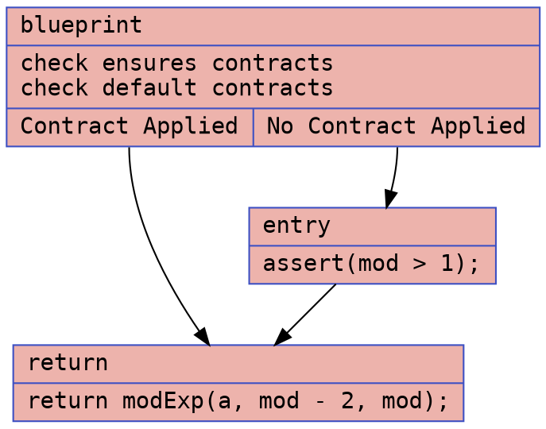
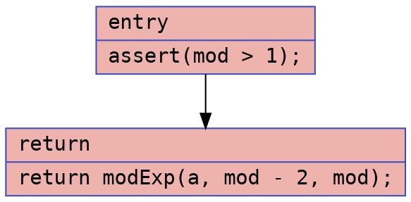
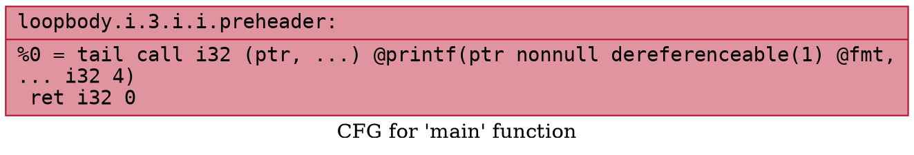

# Modular Inverse Example

### CFG (.dot)

### Cyclomatic Complexity
Number of Nodes = 3
Number of Edges = 3
Cyclomatic Complexity = E - N + 2 = 3 - 3 + 2 = 2

### CFG (.dot)

### Cyclomatic Complexity
Number of Nodes = 2
Number of Edges = 1
Cyclomatic Complexity = E - N + 2 = 1 - 2 + 2 = 1

## `mod_inverse.ll`

### CFG (.dot)

### Cyclomatic Complexity
Number of Nodes = 1
Number of Edges = 0
Cyclomatic Complexity = E - N + 2 = 0 - 1 + 2 = 1

## `mod_inverse-defensive.ll`

### CFG (.dot)

### Cyclomatic Complexity
Number of Nodes = 1
Number of Edges = 0
Cyclomatic Complexity = E - N + 2 = 0 - 1 + 2 = 1
