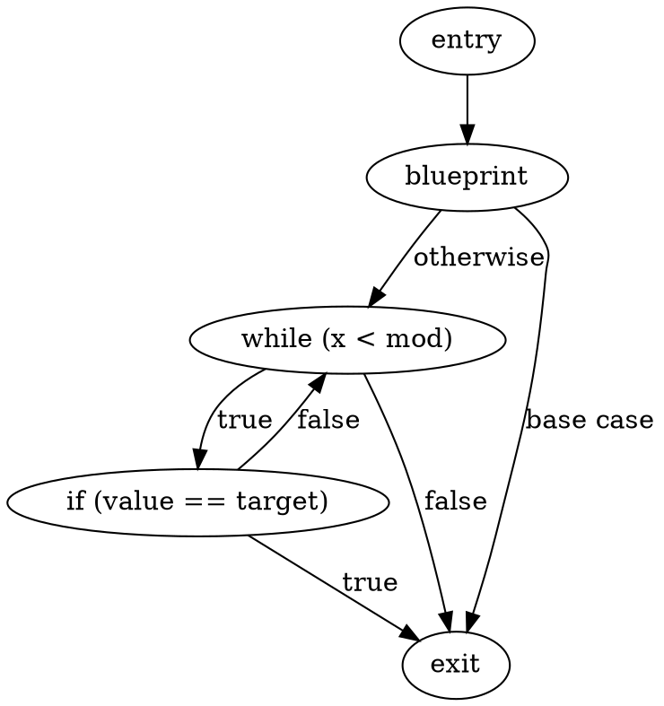
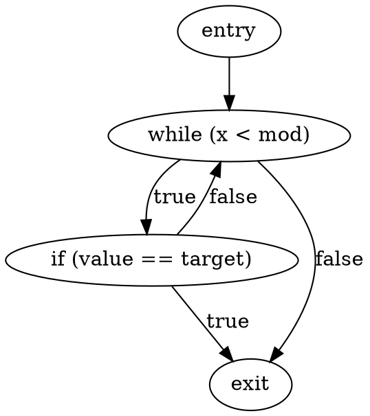
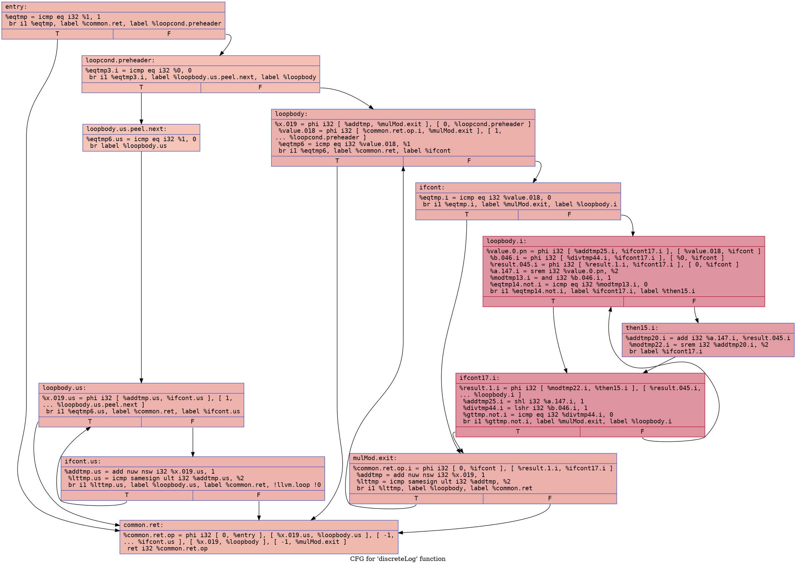
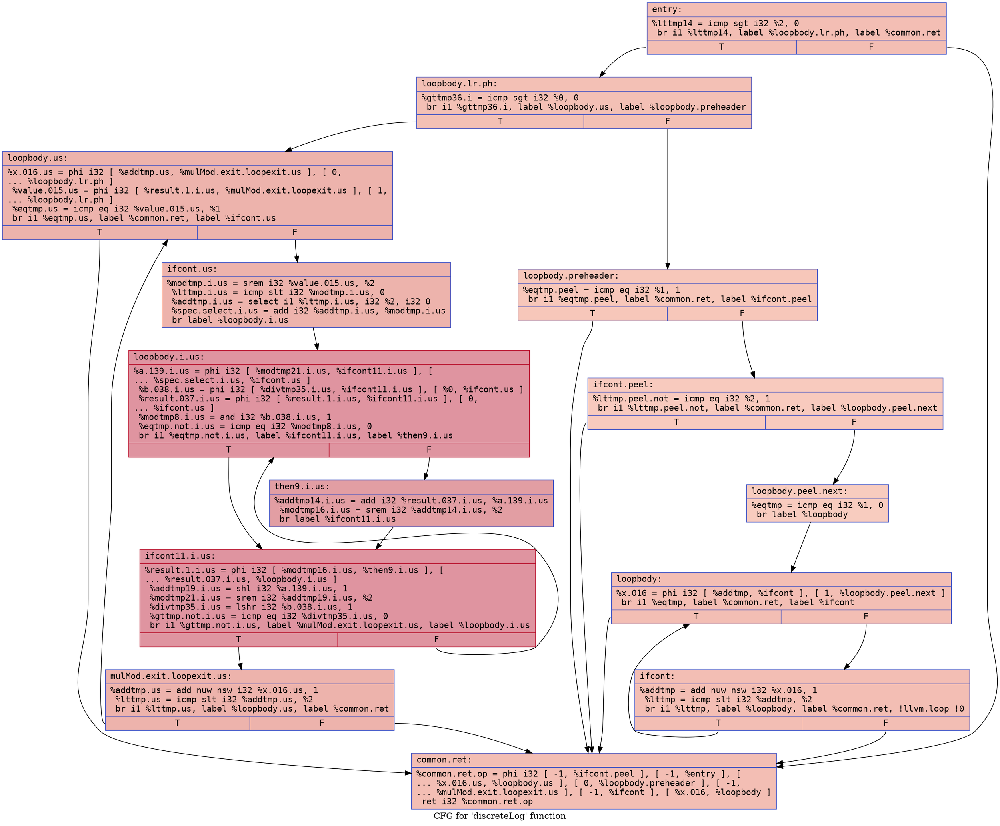

# Naive Discrete Logarithm Example

## `naive_dlog.bps`

### CFG (.dot)

### Cyclomatic Complexity
Cyclomatic Complexity = 4

## `naive_dlog-defensive.bps`

### CFG (.dot)

### Cyclomatic Complexity
Cyclomatic Complexity = 3

## `naive_dlog.ll`

### CFG (.dot)

### Cyclomatic Complexity
Number of Nodes = 12
Number of Edges = 20
Cyclomatic Complexity = E - N + 2 = 20 - 12 + 2 = 10

## `naive_dlog-defensive.ll`

### CFG (.dot)

### Cyclomatic Complexity
Number of Nodes = 14
Number of Edges = 22
Cyclomatic Complexity = E - N + 2 = 22 - 14 + 2 = 10
