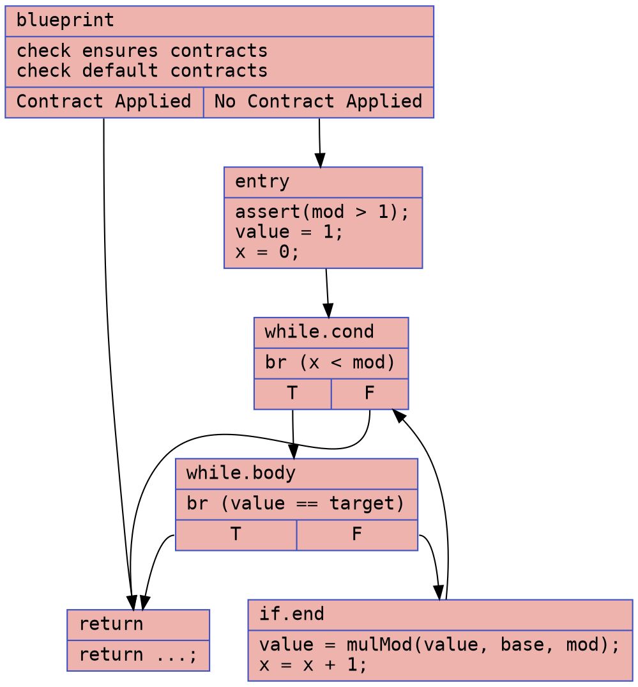
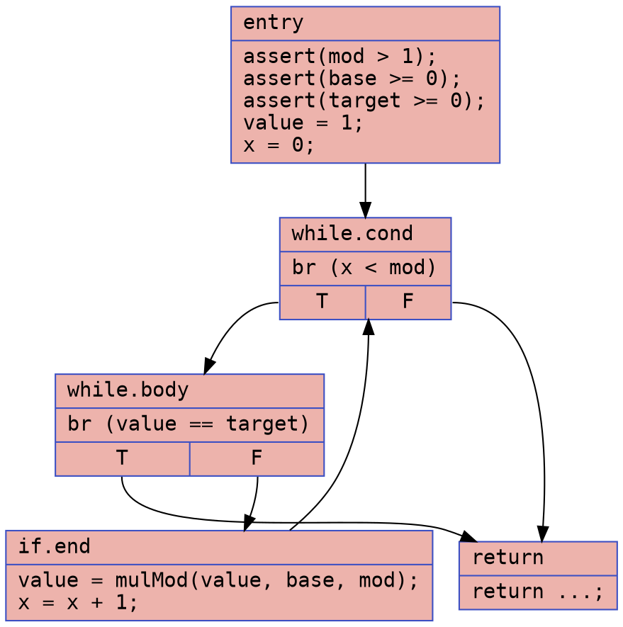
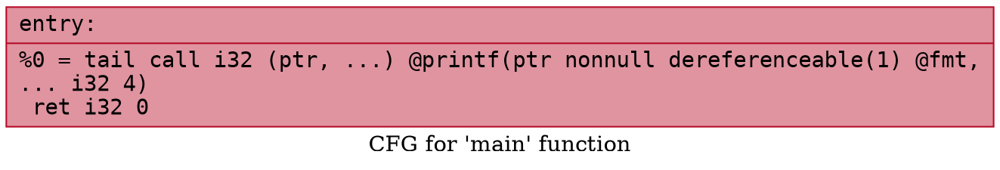

# Naive Discrete Logarithm Example

### CFG (.dot)

### Cyclomatic Complexity
Number of Nodes = 6
Number of Edges = 8
Cyclomatic Complexity = E - N + 2 = 8 - 6 + 2 = 4

### CFG (.dot)

### Cyclomatic Complexity
Number of Nodes = 5
Number of Edges = 6
Cyclomatic Complexity = E - N + 2 = 6 - 5 + 2 = 3

## `naive_dlog.ll`

### CFG (.dot)

### Cyclomatic Complexity
Number of Nodes = 1
Number of Edges = 0
Cyclomatic Complexity = E - N + 2 = 0 - 1 + 2 = 1

## `naive_dlog-defensive.ll`

### CFG (.dot)

### Cyclomatic Complexity
Number of Nodes = 1
Number of Edges = 0
Cyclomatic Complexity = E - N + 2 = 0 - 1 + 2 = 1
