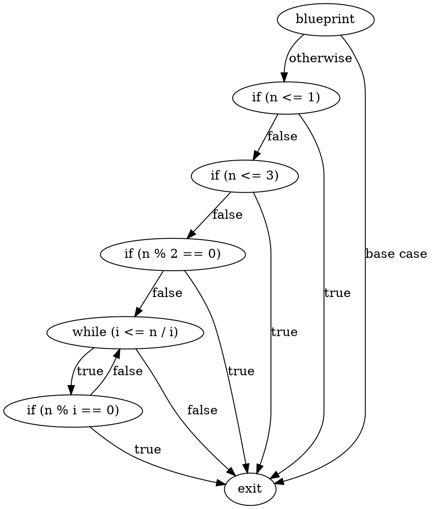
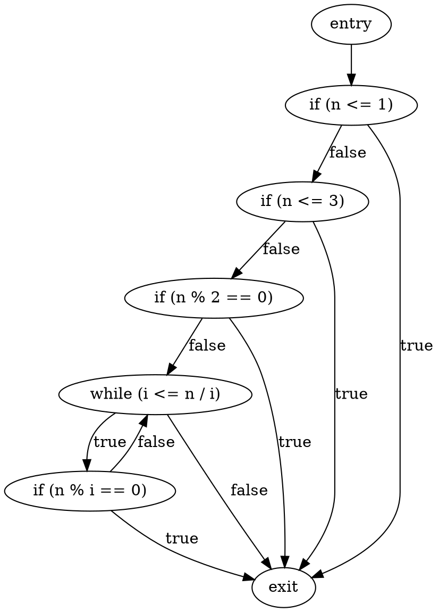
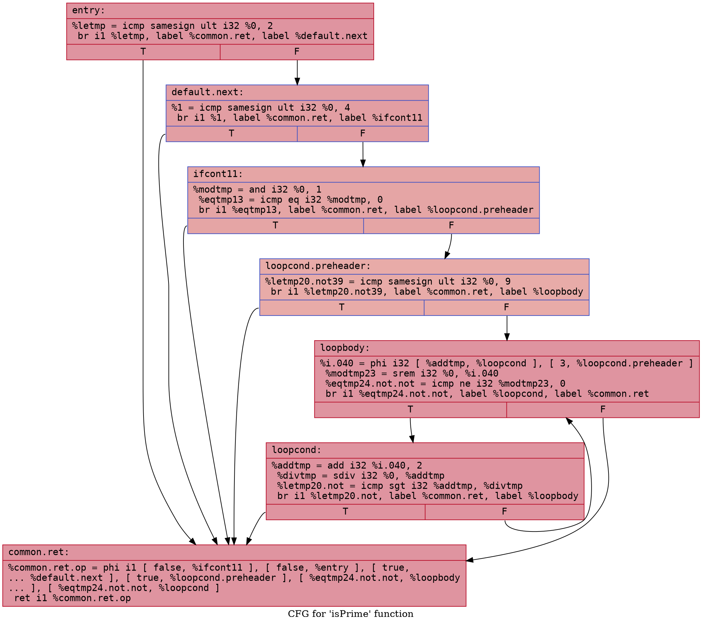
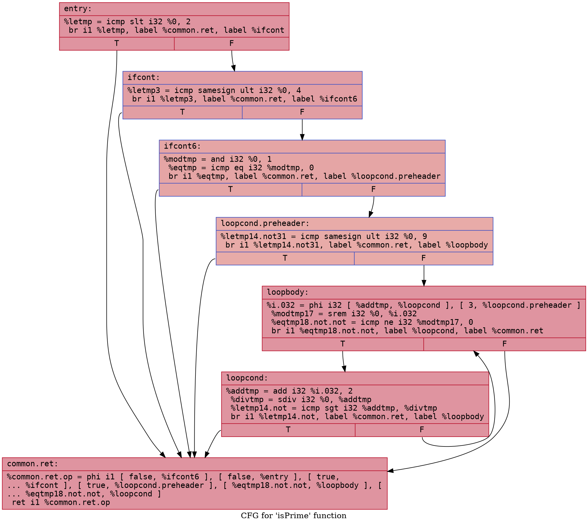

# Prime Test Example

## `prime_test.bps`

### CFG (.dot)

### Cyclomatic Complexity
Number of Nodes = 7
Number of Edges = 12
Cyclomatic Complexity = E - N + 2 = 12 - 7 + 2 = 7

## `prime_test-defensive.bps`

### CFG (.dot)

### Cyclomatic Complexity
Number of Nodes = 7
Number of Edges = 11
Cyclomatic Complexity = E - N + 2 = 11 - 7 + 2 = 6

## `prime_test.ll`

### CFG (.dot)

### Cyclomatic Complexity
Number of Nodes = 7
Number of Edges = 12
Cyclomatic Complexity = E - N + 2 = 12 - 7 + 2 = 7

## `prime_test-defensive.ll`

### CFG (.dot)

### Cyclomatic Complexity
Number of Nodes = 7
Number of Edges = 12
Cyclomatic Complexity = E - N + 2 = 12 - 7 + 2 = 7
