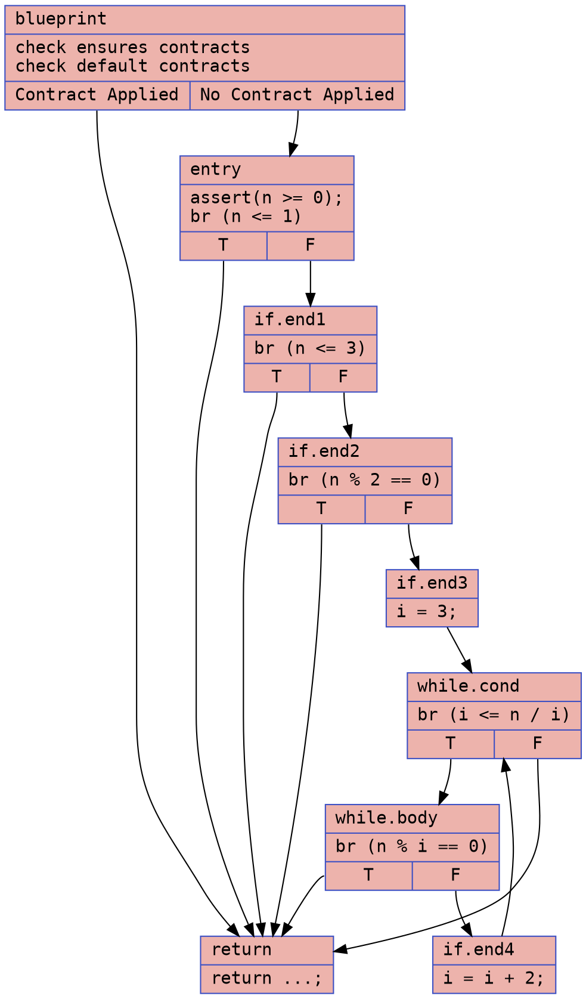
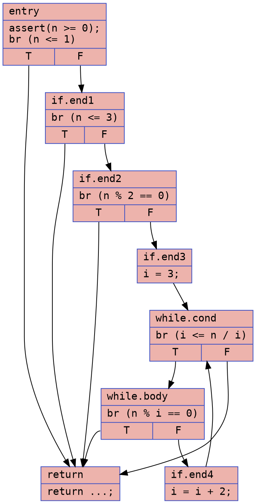
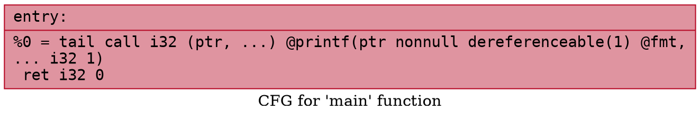

# Prime Test Example

### CFG (.dot)

### Cyclomatic Complexity
Number of Nodes = 9
Number of Edges = 14
Cyclomatic Complexity = E - N + 2 = 14 - 9 + 2 = 7

### CFG (.dot)

### Cyclomatic Complexity
Number of Nodes = 8
Number of Edges = 12
Cyclomatic Complexity = E - N + 2 = 12 - 8 + 2 = 6

## `prime_test.ll`

### CFG (.dot)

### Cyclomatic Complexity
Number of Nodes = 1
Number of Edges = 0
Cyclomatic Complexity = E - N + 2 = 0 - 1 + 2 = 1

## `prime_test-defensive.ll`

### CFG (.dot)

### Cyclomatic Complexity
Number of Nodes = 1
Number of Edges = 0
Cyclomatic Complexity = E - N + 2 = 0 - 1 + 2 = 1
