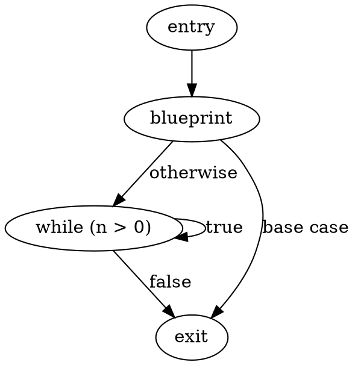
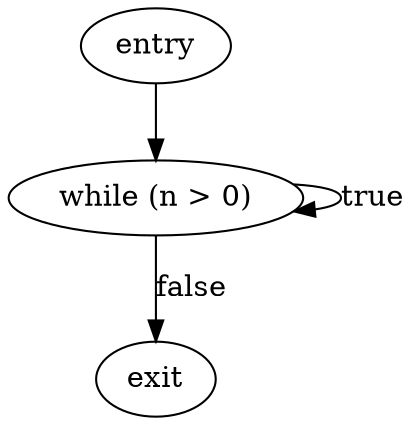
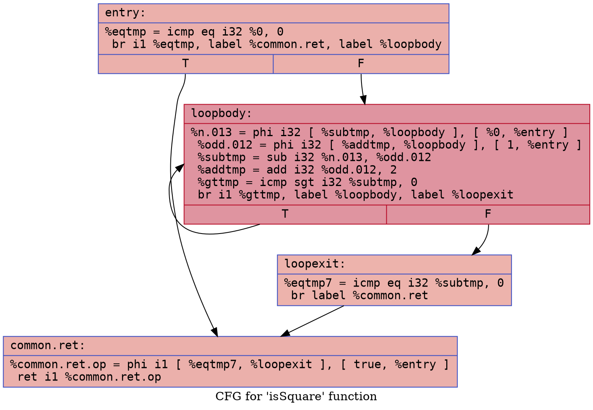
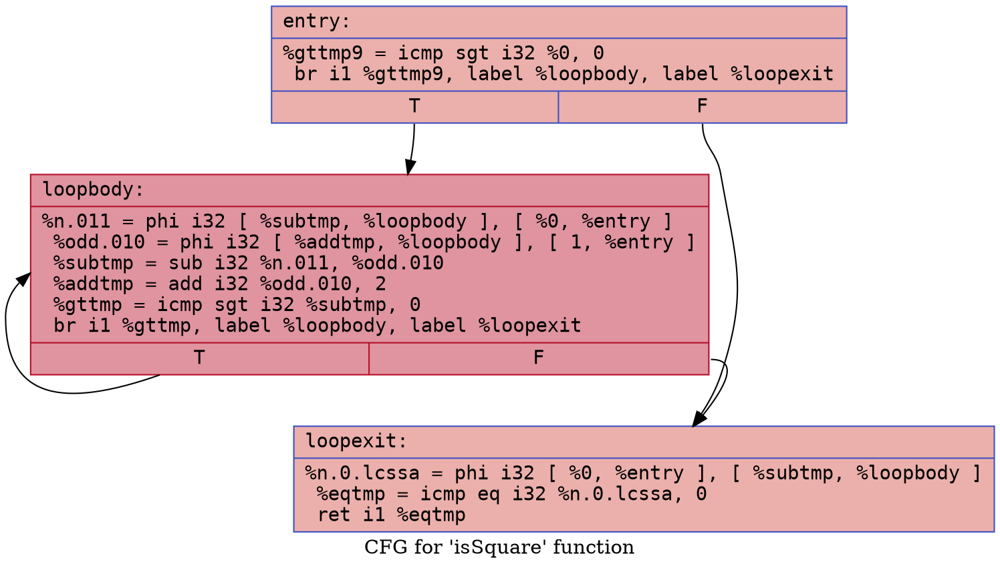

# Square Test Example

## `square_test.bps`

### CFG (.dot)

### Cyclomatic Complexity
Cyclomatic Complexity = 3

## `square_test-defensive.bps`

### CFG (.dot)

### Cyclomatic Complexity
Cyclomatic Complexity = 2

## `square_test.ll`

### CFG (.dot)

### Cyclomatic Complexity
Number of Nodes = 4
Number of Edges = 5
Cyclomatic Complexity = E - N + 2 = 5 - 4 + 2 = 3

## `square_test-defensive.ll`

### CFG (.dot)

### Cyclomatic Complexity
Number of Nodes = 3
Number of Edges = 4
Cyclomatic Complexity = E - N + 2 = 4 - 3 + 2 = 3
