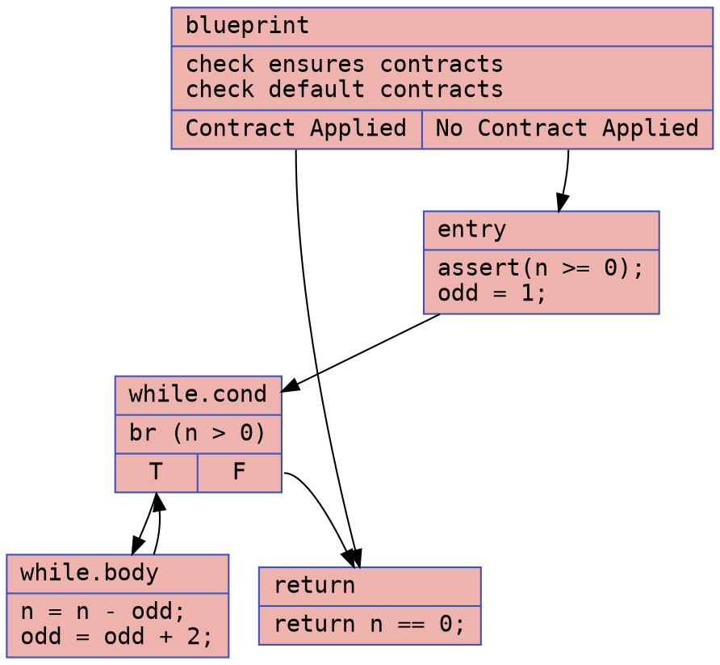
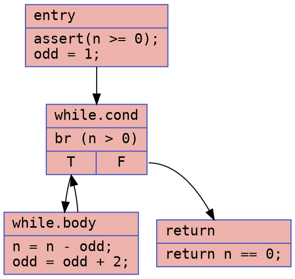
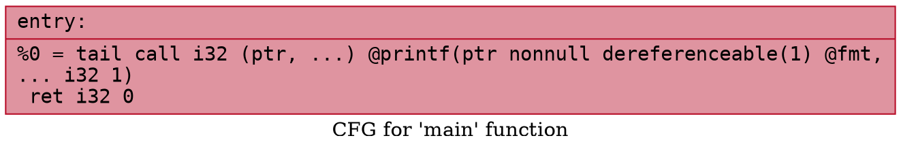

# Square Test Example

### CFG (.dot)

### Cyclomatic Complexity
Number of Nodes = 5
Number of Edges = 6
Cyclomatic Complexity = E - N + 2 = 6 - 5 + 2 = 3

### CFG (.dot)

### Cyclomatic Complexity
Number of Nodes = 4
Number of Edges = 4
Cyclomatic Complexity = E - N + 2 = 4 - 4 + 2 = 2

## `square_test.ll`

### CFG (.dot)

### Cyclomatic Complexity
Number of Nodes = 1
Number of Edges = 0
Cyclomatic Complexity = E - N + 2 = 0 - 1 + 2 = 1

## `square_test-defensive.ll`

### CFG (.dot)

### Cyclomatic Complexity
Number of Nodes = 1
Number of Edges = 0
Cyclomatic Complexity = E - N + 2 = 0 - 1 + 2 = 1
